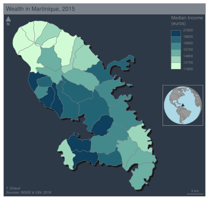

<!-- README.md is generated from README.Rmd. Please edit that file -->

```{r, include = FALSE}
knitr::opts_chunk$set(
  collapse = TRUE,
  comment = "#>",
  fig.path = "man/figures/README-", 
  fig.width = 5
  # out.width = "100%"
)
```

# mapsf 

<!-- badges: start -->

[](https://codecov.io/gh/riatelab/mapsf) [](https://github.com/riatelab/mapsf/actions)
<!-- badges: end -->

Create and integrate thematic maps in your R workflow. This package helps to 
design various cartographic representations such as proportional
symbols, choropleth or typology maps. It also offers several functions to
display layout elements that improve the graphic presentation of maps
(e.g. scale bar, north arrow, title, labels). `mapsf` maps `sf` objects on
`base` graphics.

## Installation

<!-- You can install the released version of mapsf  -->
<!-- from [CRAN](https://CRAN.R-project.org) with: -->

<!-- ``` r -->
<!-- install.packages("mapsf") -->
<!-- ``` -->

<!-- Alternatively,  -->
You can install the development version of `mapsf` 
from GitHub with:

``` r
remotes::install_github("riatelab/mapsf")
```


## Examples

This is a basic example which shows how to create a map with `mapsf`.  
The main `mapsf` function is `mf_map()`. 


```{r example1}
library(mapsf)
# Import the sample dataset
mtq <- mf_get_mtq()
# Plot the base map
mf_map(x = mtq)
# Plot proportional symbols
mf_map(x = mtq, var = "POP", type = "prop")
# Plot a map layout
mf_layout(title = "Population in Martinique", 
          credits = "T. Giraud; Sources: INSEE & IGN, 2018", 
          frame = TRUE)
box(which = "figure")
```


A more detailed example:

```{r example3, results=FALSE}
# Initiate a map figure with a theme and extra margins 
mf_init(x = mtq, theme = "dark", expandBB = c(0,0,0,.3),
        export = "svg", filename = "man/figures/mtq.svg", width = 6) 
# Plot a shadow
mf_shadow(mtq, col = "grey10", add = TRUE)
# Plot a choropleth map
mf_map(x = mtq, var = "MED", type = "choro",
       pal = "Dark Mint", 
       breaks = "quantile", 
       nbreaks = 6, 
       leg_title = "Median Income\n(euros)", 
       leg_val_rnd = -2, 
       add = TRUE)
# Start an inset map
mf_inset_on(x = "worldmap", pos = "right")
# Plot the position of the sample dataset on a worlmap
mf_worldmap(mtq, col = "#0E3F5C")
# Close the inset
mf_inset_off()
# Plot a title
mf_title("Wealth in Martinique, 2015")
# Plot credits
mf_credits("T. Giraud\nSources: INSEE & IGN, 2018")
# Plot a scale bar
mf_scale(size = 5)
# Plot a north arrow
mf_arrow('topleft')
dev.off()
```




Note that `mapsf` is, to a certain degree, compatible with the pipe syntax:

```{r example4, results=FALSE}
library(magrittr)
mf_theme("agolalight")
mf_get_mtq() %>% 
  mf_shadow() %>%
  mf_map(add = TRUE) %>%
  mf_map("POP", "prop", col = "white")
mf_title()
```


## Main features

The **type** column indicates the value to use for the `type` argument in `mf_map(x, var, type)`. The **data** column displays the relevant data types for each map types. 


## Background

This package aims at reproducing the core features of 
[`cartography`](https://github.com/riatelab/cartography) with a more 
coherent and modern API. It is lighter (less dependencies) and more 
user-friendly.


## Alternatives

-   [cartography](https://github.com/riatelab/cartography)
-   [tmap](https://github.com/mtennekes/tmap)  
-   [ggplot2](https://github.com/tidyverse/ggplot2) + [ggspatial](https://github.com/paleolimbot/ggspatial)  
-   [oceanis](https://github.com/insee-psar-at/oceanis-package)

## Community Guidelines

One can contribute to the package through [pull requests](https://github.com/riatelab/mapsf/pulls) and report issues or ask questions [here](https://github.com/riatelab/mapsf/issues).  
This project uses [conventional commits](https://www.conventionalcommits.org/en/v1.0.0-beta.3/) and [semantic versioning](https://semver.org/).
