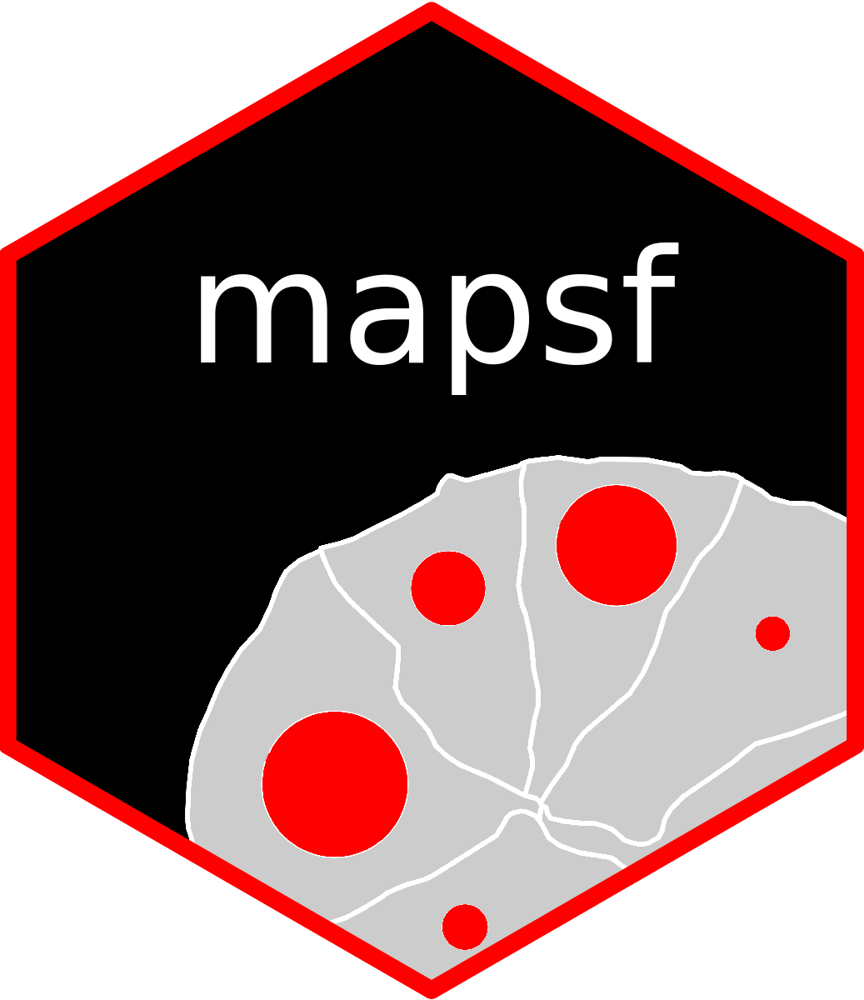
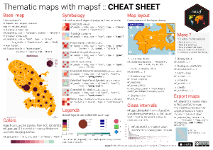
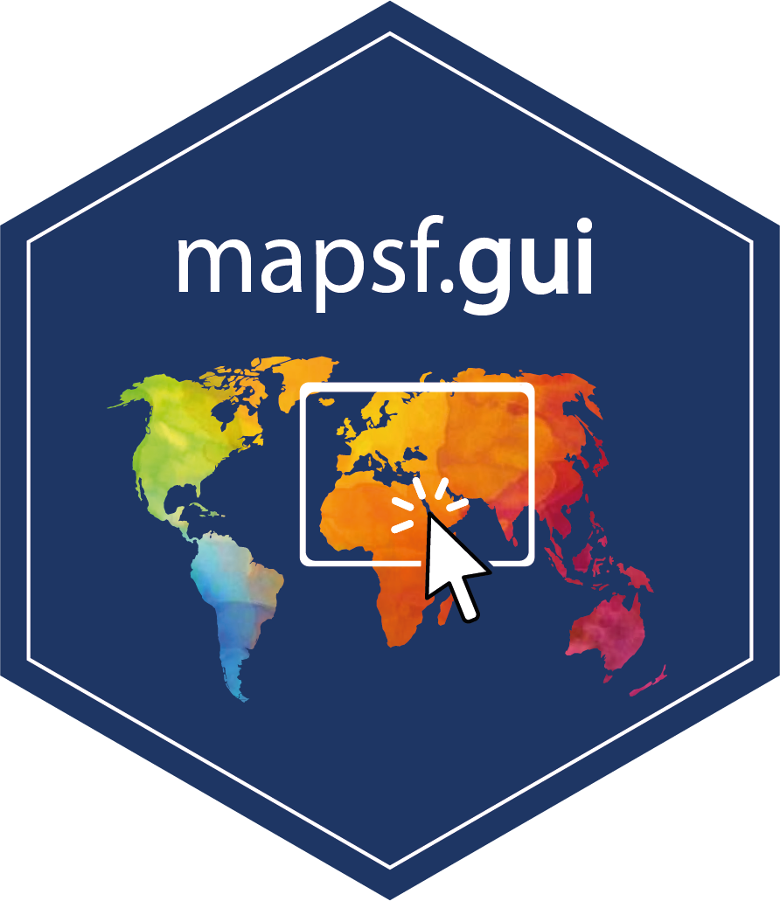

```{r, include = FALSE}
knitr::opts_chunk$set(
  collapse = TRUE,
  comment = "#>",
  fig.path = "man/figures/",
  fig.width = 5, fig.height = 6,
  dev = "png", dpi = 110
  # out.width = "100%"
)
```


```{r, include=FALSE}
library(covr)
coverage <- round(percent_coverage(package_coverage()),0)
```


# mapsf 

[](https://cran.r-project.org/package=mapsf)
[](https://riatelab.r-universe.dev/mapsf)

[](https://CRAN.R-project.org/package=mapsf)
[](https://cran.r-project.org/package=mapsf)

**Create thematic maps and integrate them into your R workflow.**  

This package helps you design different cartographic representations such as 
proportional symbols, choropleths, or typology maps. It also provides several 
functions for displaying layout elements that enhance the graphical presentation of maps 
(e.g., scale bar, north arrow, title, labels). `mapsf` maps `sf` objects on `base` graphics.

## Installation

You can install the released version of `mapsf`
from [CRAN](https://cran.r-project.org/package=mapsf) with:
``` r
install.packages("mapsf")
```


Alternatively, you can install the development version of `mapsf` (the **dev** branch) from [r-universe](https://riatelab.r-universe.dev/mapsf) with:
``` r
install.packages("mapsf", repos = c("https://riatelab.r-universe.dev", "https://cloud.r-project.org"))
```


## Usage

This is a basic example which shows how to create a map with `mapsf`.  

```{r example1, fig.width = 4, fig.height = 5, fig.alt="A simple map created with mapsf"}
library(mapsf)
# Import the sample dataset
mtq <- mf_get_mtq()
# Plot the base map
mf_map(x = mtq)
# Plot proportional symbols
mf_map(x = mtq, var = "POP", type = "prop", leg_pos = "topright", add = TRUE)
# Plot a map layout
mf_layout(
  title = "Population in Martinique",
  credits = "T. Giraud; Sources: INSEE & IGN, 2018"
)
```

You can find more detailed examples on the ["Get Started"](https://riatelab.github.io/mapsf/articles/mapsf) section of the [package website](https://riatelab.github.io/mapsf/) and you can also download its [cheat sheet](https://raw.githubusercontent.com/riatelab/mapsf/master/vignettes/fig/mapsf_cheatsheet.pdf).    
[](https://raw.githubusercontent.com/riatelab/mapsf/master/vignettes/fig/mapsf_cheatsheet.pdf)  


## mapsf.gui 

The [`mapsf.gui` package](https://codeberg.org/riatelab/mapsf.gui) provides a Shiny interface for creating thematic maps using `mapsf`.
Users of the application can **build thematic maps interactively and automatically generate the corresponding R code** to reproduce the map identically.


## Alternatives

- [`tmap`](https://github.com/r-tmap/tmap)
- [`ggplot2`](https://github.com/tidyverse/ggplot2) + [`ggspatial`](https://github.com/paleolimbot/ggspatial)

## Community Guidelines

One can contribute to the package through [pull requests](https://github.com/riatelab/mapsf/pulls) and report issues or ask questions [here](https://github.com/riatelab/mapsf/issues). See the [CONTRIBUTING.md](https://github.com/riatelab/mapsf/blob/master/CONTRIBUTING.md) file for detailed instructions on how to contribute.   
This project uses [conventional commits](https://www.conventionalcommits.org/en/v1.0.0-beta.3/) and [semantic versioning](https://semver.org/).
