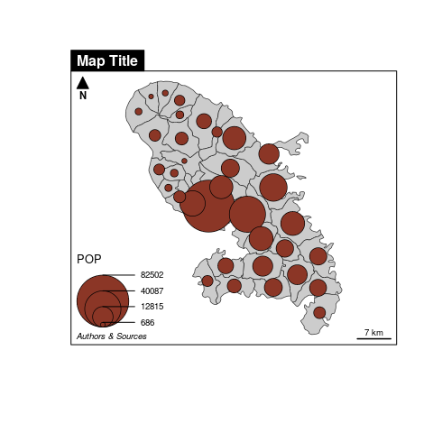

<!-- README.md is generated from README.Rmd. Please edit that file -->

# mapsf 

<!-- badges: start -->

[](undefined)
[](https://github.com/riatelab/mapsf/actions)
<!-- badges: end -->

Create maps with simple features. `mapsf` helps to map `sf` objects and
offers features that improve the graphic presentation of maps (scale
bar, north arrow, title or legend).

## Installation

You can install the released version of mapsf from
[CRAN](https://CRAN.R-project.org) with:

``` r
install.packages("mapsf")
```

Alternatively, you can install the development version of mapsf from
GitHub with:

``` r
remotes::install_github("riatelab/mapsf")
```

## Examples

This is a basic example which shows you how to create a map with
`mapsf`. The main `mapsf` function is `mf_map()`.

``` r
library(mapsf)
#> Loading required package: sf
#> Linking to GEOS 3.7.1, GDAL 3.1.2, PROJ 7.1.0
mtq <- mf_get_mtq()
mf_map(x = mtq)
mf_map(x = mtq, var = "POP", type = "prop")
mf_layout(frame = TRUE)
```

<!-- -->

A more detailed example:

``` r
mf_init(x = mtq, theme = "dark", shadow = TRUE, shadow_col = "grey10",
        export = "svg", filename = "man/figures/mtq.svg", width = 6, 
        expandBB = c(0,0,0,.3)) 
mf_map(x = mtq, var = "MED", type = "choro",
       pal = "Dark Mint", 
       breaks = "quantile", 
       nbreaks = 6, 
       leg_title = "Median Income\n(euros)", 
       leg_val_rnd = -2, 
       add = T)
mf_title("Wealth in Martinique, 2015")
mf_credits("T. Giraud\nSources: INSEE & IGN, 2018")
mf_scale(size = 5)
mf_arrow('topleft')
dev.off()
```


## Background

This package aims at reproducing the core features of
[`cartography`](https://github.com/riatelab/cartography) with a more
coherent and modern API. It is lighter (less dependencies) and more
user-friendly.

## Alternatives

-   [cartography](https://github.com/riatelab/cartography)
-   [tmap](https://github.com/mtennekes/tmap)  
-   [ggplot2](https://github.com/tidyverse/ggplot2) +
    [ggspatial](https://github.com/paleolimbot/ggspatial)  
-   [oceanis](https://github.com/insee-psar-at/oceanis-package)

## Community Guidelines

One can contribute to the package through [pull
requests](https://github.com/riatelab/mapsf/pulls) and report issues or
ask questions [here](https://github.com/riatelab/mapsf/issues).
