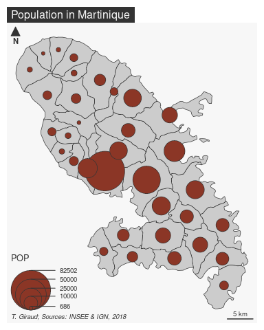
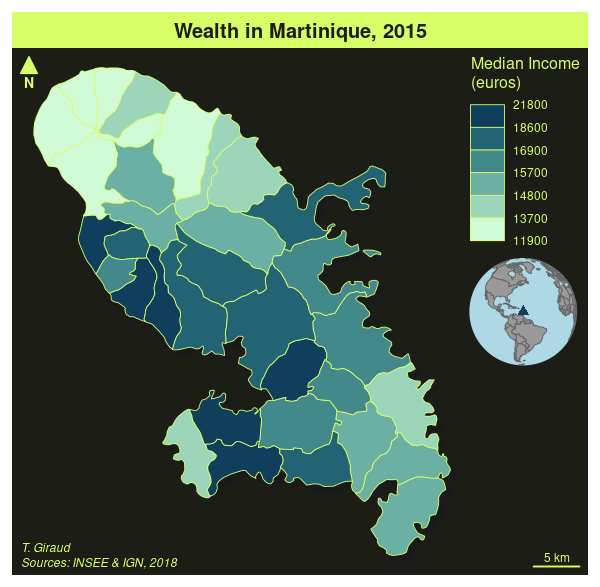

<!-- README.md is generated from README.Rmd. Please edit that file -->

# mapsf 

<!-- badges: start -->

[](https://cran.r-project.org/package=mapsf)
[](https://github.com/riatelab/mapsf/actions/workflows/R-CMD-check.yaml)
[](https://cran.r-project.org/package=mapsf)
[](https://app.codecov.io/gh/riatelab/mapsf?branch=master)
[](https://CRAN.R-project.org/package=mapsf)
[](https://www.bestpractices.dev/projects/8704)
[](https://www.repostatus.org/#active)
<!-- badges: end -->

Create and integrate thematic maps in your R workflow. This package
helps to design various cartographic representations such as
proportional symbols, choropleth or typology maps. It also offers
several functions to display layout elements that improve the graphic
presentation of maps (e.g. scale bar, north arrow, title, labels).
`mapsf` maps `sf` objects on `base` graphics.

## Installation

You can install the released version of `mapsf` from
[CRAN](https://cran.r-project.org/package=mapsf) with:

``` r
install.packages("mapsf")
```

Alternatively, you can install the development version of `mapsf` from
GitHub (**dev** branch) with:

``` r
remotes::install_github("riatelab/mapsf", ref = "dev")
```

## Usage

This is a basic example which shows how to create a map with `mapsf`.  
The main `mapsf` function is `mf_map()`.

``` r
library(mapsf)
# Import the sample dataset
mtq <- mf_get_mtq()
# Plot the base map
mf_map(x = mtq)
# Plot proportional symbols
mf_map(x = mtq, var = "POP", type = "prop", leg_pos = "topright")
# Plot a map layout
mf_layout(
  title = "Population in Martinique",
  credits = "T. Giraud; Sources: INSEE & IGN, 2018"
)
```

<!-- -->

A more detailed example:

``` r
# Export a map with a theme and extra margins
mf_theme("green")
mf_export(
  x = mtq, filename = "mtq.png",
  width = 600, res = 120,
  expandBB = c(0, 0, 0, .3)
)
# Plot a shadow
mf_shadow(mtq, col = "grey10", add = TRUE)
# Plot a choropleth map
mf_map(
  x = mtq, var = "MED", type = "choro",
  pal = "Dark Mint",
  breaks = "quantile",
  nbreaks = 6,
  leg_title = "Median Income\n(euros)",
  leg_val_rnd = -2,
  add = TRUE
)
# Start an inset map
mf_inset_on(x = "worldmap", pos = "right")
# Plot mtq position on a worldmap
mf_worldmap(mtq, col = "#0E3F5C")
# Close the inset
mf_inset_off()
# Plot a title
mf_title("Wealth in Martinique, 2015")
# Plot credits
mf_credits("T. Giraud\nSources: INSEE & IGN, 2018")
# Plot a scale bar
mf_scale(size = 5)
# Plot a north arrow
mf_arrow("topleft")
dev.off()
```



## Resources

<table>
<colgroup>
<col style="width: 50%" />
<col style="width: 50%" />
</colgroup>
<tbody>
<tr class="odd">
<td style="text-align: center;">
<p>
<a href="https://raw.githubusercontent.com/riatelab/mapsf/master/vignettes/web_only/img/mapsf_cheatsheet.pdf"></a>
</p>
<p>
<a href="https://raw.githubusercontent.com/riatelab/mapsf/master/vignettes/web_only/img/mapsf_cheatsheet.pdf">Cheat
Sheet</a>
</p>
</td>
<td style="text-align: center;">
<p>
<a href="https://riatelab.github.io/mapsf/"></a>
</p>
<p>
<a href="https://riatelab.github.io/mapsf/">Website</a>
</p>
</td>
</tr>
</tbody>
</table>

- `mapsf`, a New Package for Thematic Mapping - useR 2021!
  [Video](https://youtu.be/8PMF7cBBH7k?t=2621) &
  [Slides](https://rcarto.github.io/user2021/) - FOSS4G 2021
  [Video](https://www.youtube.com/watch?v=dBNp0bzD454) &
  [Slides](https://rcarto.github.io/foss4g2021/) (EN)  
- Créer des cartes reproductibles avec `mapsf` - Les lundis de l’Ined -
  [Slides](https://rcarto.github.io/ined2021/) (FR)

## Background

`mapsf` is the successor of
[`cartography`](https://github.com/riatelab/cartography). There are no
plans for new features or enhancements in `cartography`, but basic
maintenance and support will continue indefinitely. Existing projects
that use `cartography` can safely continue to use `cartography`. New
projects should use `mapsf` because it is friendlier, lighter and more
robust.  
See [`mapsf`
vignette](https://riatelab.github.io/mapsf/articles/mapsf.html#symbology)
to migrate from `cartography` to `mapsf`.

## Alternatives

- [cartography](https://github.com/riatelab/cartography) (*superseded by
  `mapsf`*)
- [tmap](https://github.com/r-tmap/tmap)  
- [ggplot2](https://github.com/tidyverse/ggplot2) +
  [ggspatial](https://github.com/paleolimbot/ggspatial)

## Community Guidelines

One can contribute to the package through [pull
requests](https://github.com/riatelab/mapsf/pulls) and report issues or
ask questions [here](https://github.com/riatelab/mapsf/issues). See the
[CONTRIBUTING.md](https://github.com/riatelab/mapsf/blob/master/CONTRIBUTING.md)
file for detailed instructions on how to contribute.  
This project uses [conventional
commits](https://www.conventionalcommits.org/en/v1.0.0-beta.3/) and
[semantic versioning](https://semver.org/).
