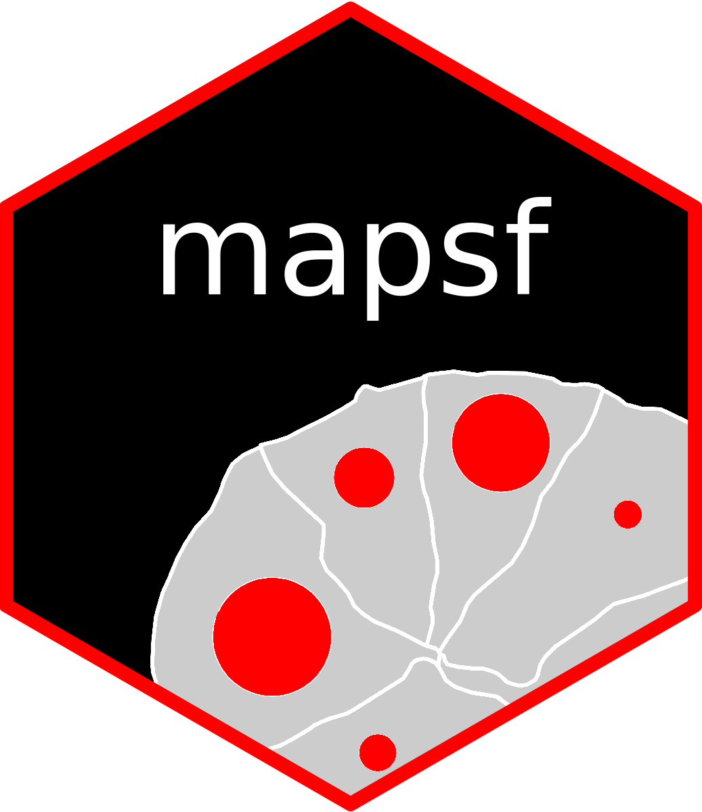
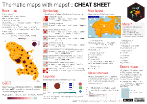
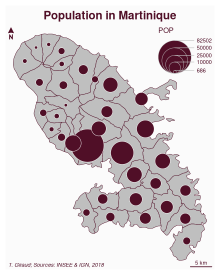
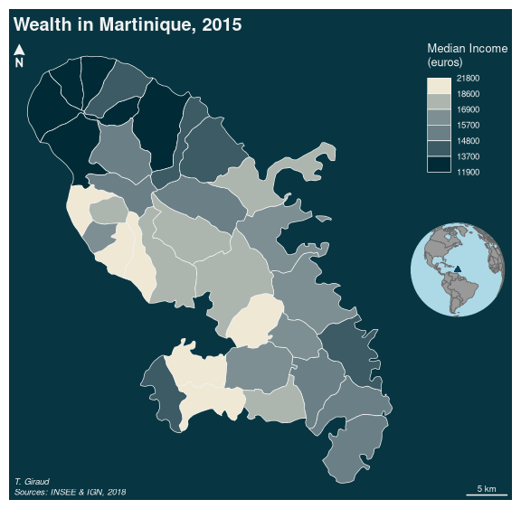

<!-- README.md is generated from README.Rmd. Please edit that file -->

# mapsf



<!-- badges: start -->

[](https://cran.r-project.org/package=mapsf)
[](https://github.com/riatelab/mapsf/actions/workflows/R-CMD-check.yaml)
[](https://cran.r-project.org/package=mapsf)
[](https://app.codecov.io/gh/riatelab/mapsf?branch=master)
[](https://CRAN.R-project.org/package=mapsf)
[](https://www.bestpractices.dev/projects/8704)
[](https://www.repostatus.org/#active)
<!-- badges: end -->

**Create thematic maps and integrate them into your R workflow.**  
This package helps you design different cartographic representations
such as proportional symbols, choropleths, or typology maps.  
It also provides several functions for displaying layout elements that
enhance the graphical presentation of maps (e.g., scale bar, north
arrow, title, labels).  
`mapsf` maps `sf` objects on `base` graphics.

<figure>

<figcaption aria-hidden="true"><a
href="https://raw.githubusercontent.com/riatelab/mapsf/master/vignettes/web_only/img/mapsf_cheatsheet.pdf">Cheat
Sheet</a> &amp; <a href="https://riatelab.github.io/mapsf/">Web
Site</a></figcaption>
</figure>

## Installation

You can install the released version of `mapsf` from
[CRAN](https://cran.r-project.org/package=mapsf) with:

``` r
install.packages("mapsf")
```

Alternatively, you can install the development version of `mapsf` from
GitHub (**dev** branch) with:

``` r
remotes::install_github("riatelab/mapsf", ref = "dev")
```

## Usage

This is a basic example which shows how to create a map with `mapsf`.  
The main `mapsf` function is `mf_map()`.

``` r
library(mapsf)
# Import the sample dataset
mtq <- mf_get_mtq()
# Plot the base map
mf_map(x = mtq)
# Plot proportional symbols
mf_map(x = mtq, var = "POP", type = "prop", leg_pos = "topright")
# Plot a map layout
mf_layout(
  title = "Population in Martinique",
  credits = "T. Giraud; Sources: INSEE & IGN, 2018"
)
```

<!-- -->

A more detailed example:

``` r
# A map with a theme and extra margins
mf_theme("sol_dark")
# Plot a choropleth map
mf_map(
  x = mtq, var = "MED", type = "choro",
  breaks = "quantile", nbreaks = 6,
  leg_title = "Median Income\n(euros)", leg_val_rnd = -2,
  expandBB = c(0, 0, 0, .3)
)
# Start an inset map
mf_inset_on(x = "worldmap", pos = "right")
# Plot mtq position on a worldmap
mf_worldmap(mtq, col = "#0E3F5C")
# Close the inset
mf_inset_off()
# Plot a title
mf_title("Wealth in Martinique, 2015")
# Plot credits
mf_credits("T. Giraud\nSources: INSEE & IGN, 2018")
# Plot a scale bar
mf_scale(size = 5)
# Plot a north arrow
mf_arrow("topleft")
```

<!-- -->

## Alternatives

- [tmap](https://github.com/r-tmap/tmap)  
- [ggplot2](https://github.com/tidyverse/ggplot2) +
  [ggspatial](https://github.com/paleolimbot/ggspatial)

## Community Guidelines

One can contribute to the package through [pull
requests](https://github.com/riatelab/mapsf/pulls) and report issues or
ask questions [here](https://github.com/riatelab/mapsf/issues). See the
[CONTRIBUTING.md](https://github.com/riatelab/mapsf/blob/master/CONTRIBUTING.md)
file for detailed instructions on how to contribute.  
This project uses [conventional
commits](https://www.conventionalcommits.org/en/v1.0.0-beta.3/) and
[semantic versioning](https://semver.org/).
