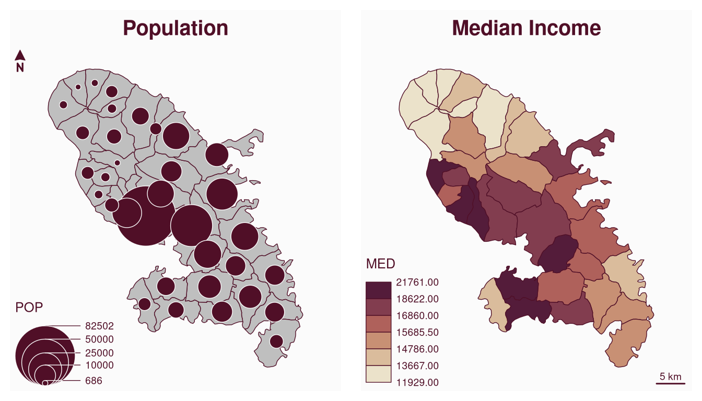
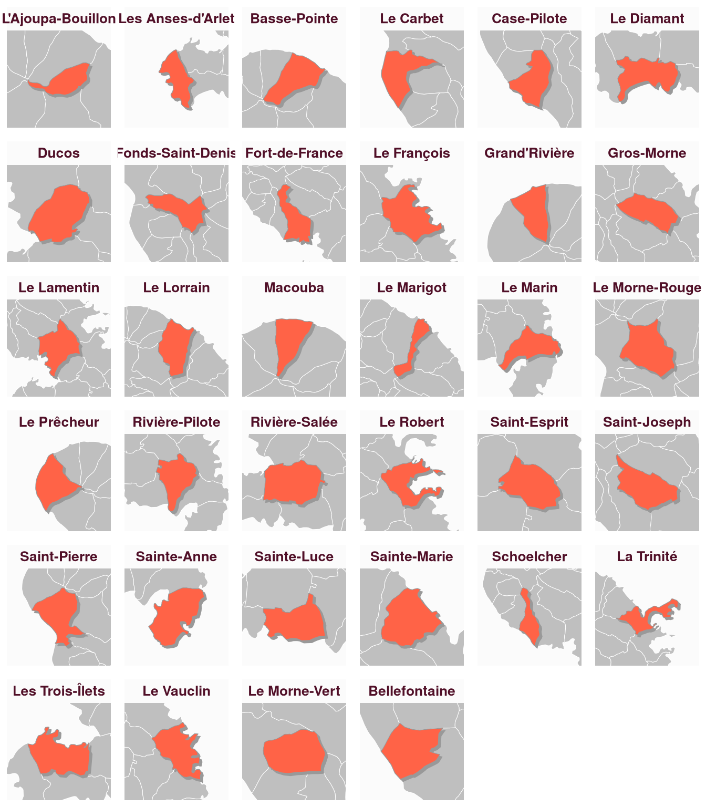

# How to Create Faceted Maps

To plot several maps on the same figure, the user can use the `mfrow`
argument of the [`par()`](https://rdrr.io/r/graphics/par.html) function
before plotting the maps. For example, use `par(mfrow = c(1, 2))`
(i.e. 1 row, 2 columns) to plot two maps side by side).

``` r

library(mapsf)
mtq <- mf_get_mtq()
# define the figure layout (1 row, 2 columns)
par(mfrow = c(1, 2))
# first map
mf_map(mtq)
mf_map(mtq, "POP", "prop", leg_pos = "bottomleft")
mf_title("Population")
mf_arrow()
# second map
mf_map(mtq, "MED", "choro", leg_pos = "bottomleft")
mf_title("Median Income")
mf_scale()
```



When relevant the user can use a `for` loop.

``` r

# define the figure layout (6 rows and 6 columns)
par(mfrow = c(6, 6))
for (i in seq_len(nrow(mtq))) {
  # center the map on a targeted municipality and its
  # neighborhood (with mf_map(..., col = NA, border = NA) and its expandBB arg)
  mf_map(mtq[i, ], col = NA, border = NA, expandBB = c(.3, .3, .3, .3))
  # plot the municpalities
  mf_map(mtq, border = "white", lwd = .5, add = TRUE)
  # plot the shadow of the targeted municpality
  mf_shadow(mtq[i, ], cex = .75, col = "grey60", add = TRUE)
  # plot the targeted municipality
  mf_map(mtq[i, ], col = "tomato1", border = "grey60", add = TRUE)
  # add a title
  mf_title(mtq[[i, "LIBGEO"]])
}
```


