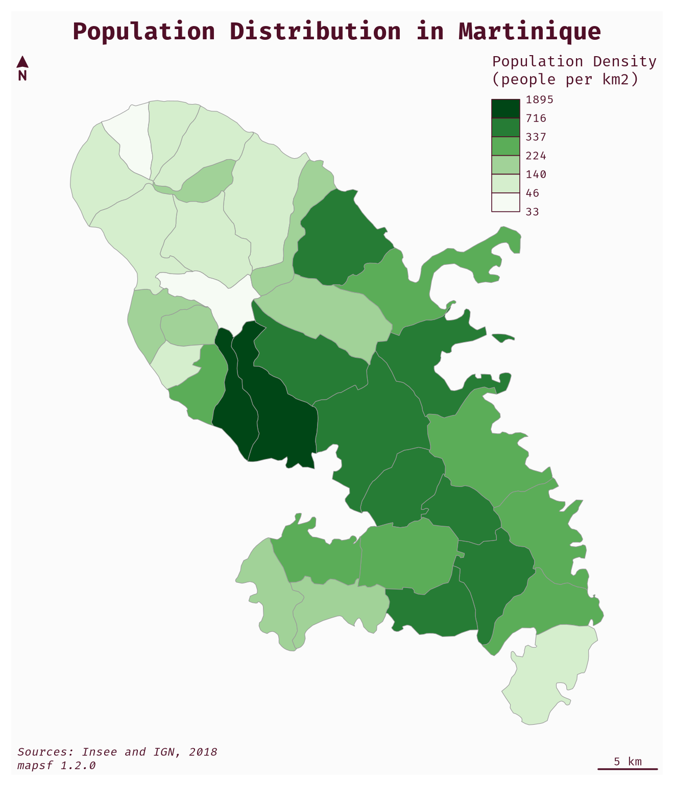

# How to Use a Custom Font Family

To use a custom font family, the user can use the `family` argument of
the [`par()`](https://rdrr.io/r/graphics/par.html) function before
plotting the map. For example, use `par(family = "Fira Code")` to use
the **Fira Code** font.  
Note that the font has to be installed on your system and recognized by
R.

``` r

library(mapsf)
# Import the sample data set
mtq <- mf_get_mtq()
# population density (inhab./km2) using sf::st_area()
mtq$POPDENS <- 1e6 * mtq$POP / sf::st_area(mtq)
# Define the font family
# !! Select a font already installed on your system !!
par(family = "Fira Code")
# set a theme
mf_theme("base")
# plot population density
mf_map(
  x = mtq,
  var = "POPDENS",
  type = "choro",
  breaks = "q6",
  nbreaks = 4,
  pal = "Greens",
  border = "grey60",
  lwd = 0.5,
  leg_val_rnd = 0,
  leg_pos = "topright",
  leg_title = "Population Density\n(people per km2)"
)
# layout
mf_layout(
  title = "Population Distribution in Martinique",
  credits = paste0("Sources: Insee and IGN, 2018\nmapsf ", packageVersion("mapsf"))
)
```


