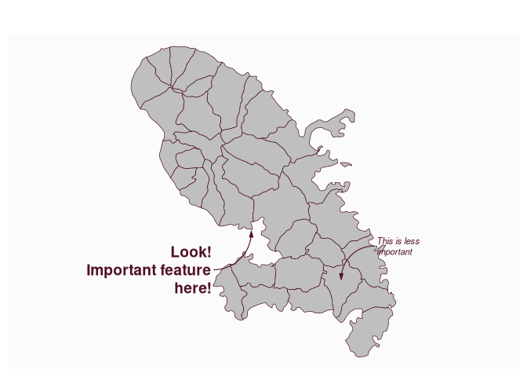

# Plot an annotation

[**Source code**](https://github.com/riatelab/mapsf//tree/master/R/mf_annotation.R#L32)

## Description

Plot an annotation on a map.

## Usage

<pre><code class='language-R'>mf_annotation(
  x,
  txt,
  pos = "topright",
  cex = 0.8,
  col_arrow,
  col_txt,
  halo = FALSE,
  bg,
  s = 1,
  ...
)
</code></pre>

## Arguments

<table role="presentation">
<tr>
<td style="white-space: nowrap; font-family: monospace; vertical-align: top">
<code id="x">x</code>
</td>
<td>
an sf object with 1 row, a couple of coordinates (c(x, y)) or
"interactive"
</td>
</tr>
<tr>
<td style="white-space: nowrap; font-family: monospace; vertical-align: top">
<code id="txt">txt</code>
</td>
<td>
the text to display
</td>
</tr>
<tr>
<td style="white-space: nowrap; font-family: monospace; vertical-align: top">
<code id="pos">pos</code>
</td>
<td>
position of the text, one of "topleft", "topright", "bottomright",
"bottomleft" or "center"
</td>
</tr>
<tr>
<td style="white-space: nowrap; font-family: monospace; vertical-align: top">
<code id="cex">cex</code>
</td>
<td>
size of the text
</td>
</tr>
<tr>
<td style="white-space: nowrap; font-family: monospace; vertical-align: top">
<code id="col_arrow">col_arrow</code>
</td>
<td>
arrow color
</td>
</tr>
<tr>
<td style="white-space: nowrap; font-family: monospace; vertical-align: top">
<code id="col_txt">col_txt</code>
</td>
<td>
text color
</td>
</tr>
<tr>
<td style="white-space: nowrap; font-family: monospace; vertical-align: top">
<code id="halo">halo</code>
</td>
<td>
add a halo around the text
</td>
</tr>
<tr>
<td style="white-space: nowrap; font-family: monospace; vertical-align: top">
<code id="bg">bg</code>
</td>
<td>
halo color
</td>
</tr>
<tr>
<td style="white-space: nowrap; font-family: monospace; vertical-align: top">
<code id="s">s</code>
</td>
<td>
arrow size (min=1)
</td>
</tr>
<tr>
<td style="white-space: nowrap; font-family: monospace; vertical-align: top">
<code id="...">…</code>
</td>
<td>
further text arguments.
</td>
</tr>
</table>

## Value

No return value, an annotation is displayed.

## Examples

``` r
library("mapsf")

mtq <- mf_get_mtq()
mf_map(mtq)
mf_annotation(
  x = c(711167.8, 1614764),
  txt = "Look!\nImportant feature\nhere!",
  pos = "bottomleft", cex = 1.2, font = 2,
  halo = TRUE, s = 1.5
)

mf_annotation(
  x = mtq[20, ],
  txt = "This is less\nimportant",
  cex = .7, font = 3, s = 1.3
)
```


