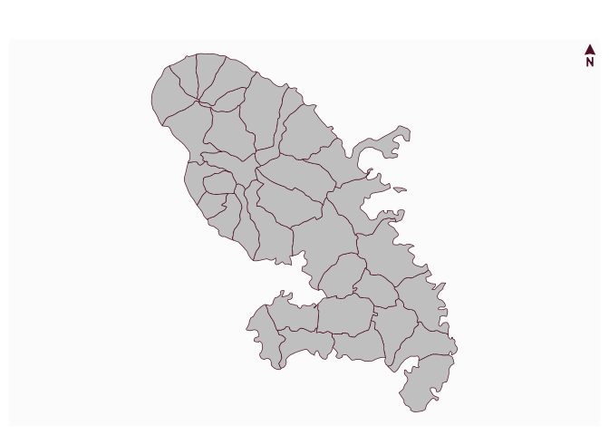

# Plot a north arrow

[**Source code**](https://github.com/riatelab/mapsf//tree/master/R/mf_arrow.R#L17)

## Description

Plot a north arrow.

## Usage

<pre><code class='language-R'>mf_arrow(pos = "topleft", col, cex = 1, adj = c(0, 0), align)
</code></pre>

## Arguments

<table role="presentation">
<tr>
<td style="white-space: nowrap; font-family: monospace; vertical-align: top">
<code id="pos">pos</code>
</td>
<td>
position. It can be one of ‘topleft’, ‘top’,‘topright’, ‘right’,
‘bottomright’, ‘bottom’,‘bottomleft’, ‘left’, ‘interactive’ or a vector
of two coordinates in map units (c(x, y))
</td>
</tr>
<tr>
<td style="white-space: nowrap; font-family: monospace; vertical-align: top">
<code id="col">col</code>
</td>
<td>
arrow color
</td>
</tr>
<tr>
<td style="white-space: nowrap; font-family: monospace; vertical-align: top">
<code id="cex">cex</code>
</td>
<td>
arrow size
</td>
</tr>
<tr>
<td style="white-space: nowrap; font-family: monospace; vertical-align: top">
<code id="adj">adj</code>
</td>
<td>
adjust the postion of the north arrow in x and y directions
</td>
</tr>
<tr>
<td style="white-space: nowrap; font-family: monospace; vertical-align: top">
<code id="align">align</code>
</td>
<td>
object of class <code>sf</code> or <code>sfc</code> used to adjust the
arrow to the real north
</td>
</tr>
</table>

## Value

No return value, a north arrow is displayed.

## Examples

``` r
library("mapsf")

mtq <- mf_get_mtq()
mf_map(mtq)
mf_arrow(pos = "topright")
```


