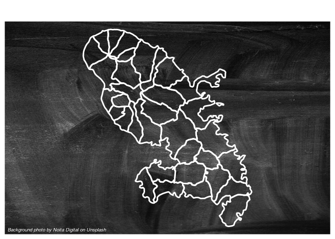

# Plot a background image

[**Source code**](https://github.com/riatelab/mapsf//tree/master/R/mf_background.R#L18)

## Description

Plot a background image on an existing plot

## Usage

<pre><code class='language-R'>mf_background(filename, ...)
</code></pre>

## Arguments

<table role="presentation">
<tr>
<td style="white-space: nowrap; font-family: monospace; vertical-align: top">
<code id="filename">filename</code>
</td>
<td>
filename of the background image, PNG or JPG/JPEG format.
</td>
</tr>
<tr>
<td style="white-space: nowrap; font-family: monospace; vertical-align: top">
<code id="...">…</code>
</td>
<td>
ignored
</td>
</tr>
</table>

## Value

No return value, a background image is displayed.

## Examples

``` r
library("mapsf")

mtq <- mf_get_mtq()
mf_map(mtq, col = NA, border = NA)
mf_background(system.file("img/background.jpg", package = "mapsf"))
mf_map(mtq, lwd = 3, col = NA, border = "white", add = TRUE)
mf_credits(
  txt = "Background photo by Noita Digital on Unsplash",
  col = "white"
)
```


