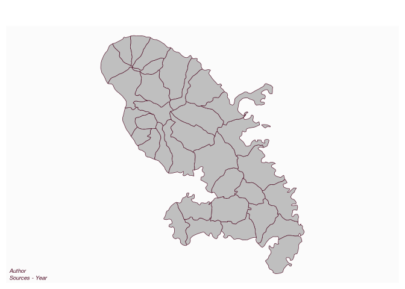

# Plot credits

[**Source code**](https://github.com/riatelab/mapsf//tree/master/R/mf_credits.R#L16)

## Description

Plot credits (sources, author, year…).

## Usage

<pre><code class='language-R'>mf_credits(
  txt = "Source(s) &amp; Author(s)",
  pos = "bottomleft",
  col,
  cex = 0.6,
  font = 3,
  bg = NA
)
</code></pre>

## Arguments

<table role="presentation">
<tr>
<td style="white-space: nowrap; font-family: monospace; vertical-align: top">
<code id="txt">txt</code>
</td>
<td>
text of the credits, use ‘’ to add line breaks
</td>
</tr>
<tr>
<td style="white-space: nowrap; font-family: monospace; vertical-align: top">
<code id="pos">pos</code>
</td>
<td>
position, one of ‘bottomleft’, ‘bottomright’ or ‘rightbottom’
</td>
</tr>
<tr>
<td style="white-space: nowrap; font-family: monospace; vertical-align: top">
<code id="col">col</code>
</td>
<td>
color
</td>
</tr>
<tr>
<td style="white-space: nowrap; font-family: monospace; vertical-align: top">
<code id="cex">cex</code>
</td>
<td>
cex of the credits
</td>
</tr>
<tr>
<td style="white-space: nowrap; font-family: monospace; vertical-align: top">
<code id="font">font</code>
</td>
<td>
font of the credits
</td>
</tr>
<tr>
<td style="white-space: nowrap; font-family: monospace; vertical-align: top">
<code id="bg">bg</code>
</td>
<td>
background color
</td>
</tr>
</table>

## Value

No return value, credits are displayed.

## Examples

``` r
library("mapsf")

mtq <- mf_get_mtq()
mf_map(mtq)
mf_credits(txt = "Author\nSources - Year")
```


