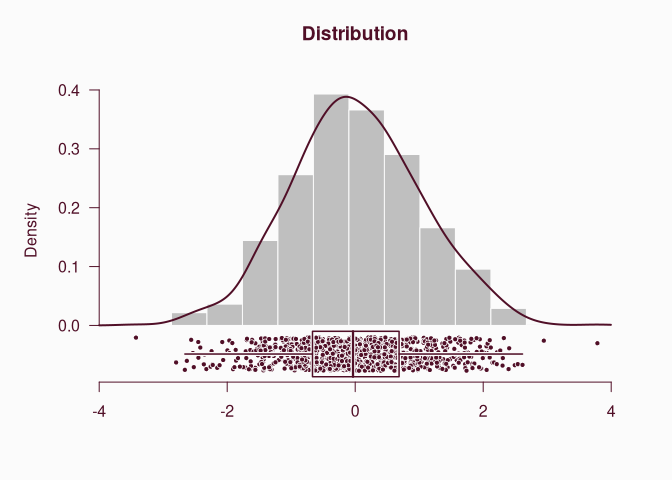
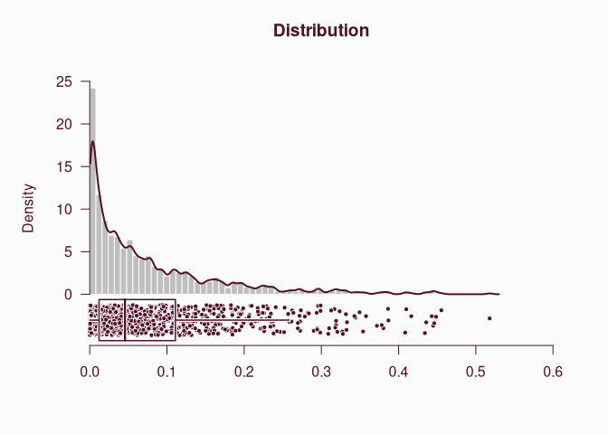
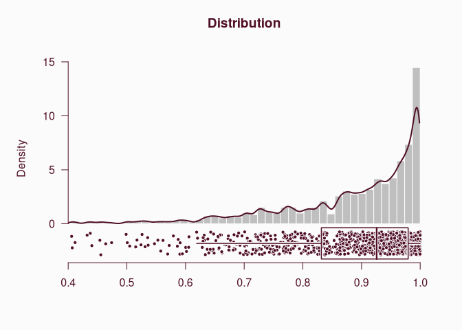

# Plot a distribution

[**Source code**](https://github.com/riatelab/mapsf//tree/master/R/mf_distr.R#L18)

## Description

This function displays a histogram, a box plot, a strip chart and a
density curve on the same plot.

## Usage

<pre><code class='language-R'>mf_distr(x, nbins, bw)
</code></pre>

## Arguments

<table role="presentation">
<tr>
<td style="white-space: nowrap; font-family: monospace; vertical-align: top">
<code id="x">x</code>
</td>
<td>
a numeric variable
</td>
</tr>
<tr>
<td style="white-space: nowrap; font-family: monospace; vertical-align: top">
<code id="nbins">nbins</code>
</td>
<td>
number of bins in the histogram
</td>
</tr>
<tr>
<td style="white-space: nowrap; font-family: monospace; vertical-align: top">
<code id="bw">bw</code>
</td>
<td>
bandwidth of the density curve
</td>
</tr>
</table>

## Value

The number of bins of the histogram and the bandwidth of the density
curve are (invisibly) returned in a list.

## Examples

``` r
library("mapsf")

(mf_distr(rnorm(1000)))
```



    $bw
    [1] 0.2721708

    $nbins
    [1] 13

``` r
mf_distr(rbeta(1000, .6, 7))
```



``` r
mf_distr(rbeta(1000, 5, .6))
```


