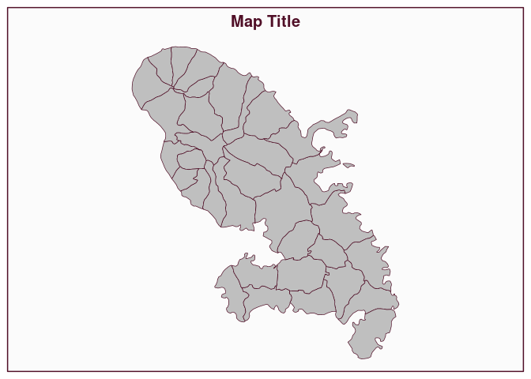
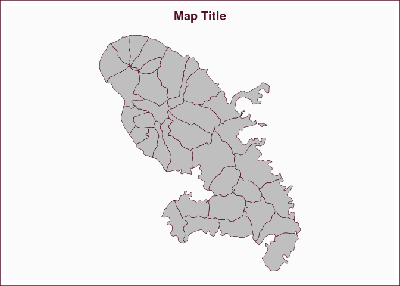

# Plot a frame

[**Source code**](https://github.com/riatelab/mapsf//tree/master/R/mf_frame.R#L20)

## Description

Plot a frame around an existing map.

## Usage

<pre><code class='language-R'>mf_frame(extent = "map", col, lwd = 1.5, lty = 1, ...)
</code></pre>

## Arguments

<table role="presentation">
<tr>
<td style="white-space: nowrap; font-family: monospace; vertical-align: top">
<code id="extent">extent</code>
</td>
<td>
type of frame, either ‘map’ or ‘figure’
</td>
</tr>
<tr>
<td style="white-space: nowrap; font-family: monospace; vertical-align: top">
<code id="col">col</code>
</td>
<td>
line color
</td>
</tr>
<tr>
<td style="white-space: nowrap; font-family: monospace; vertical-align: top">
<code id="lwd">lwd</code>
</td>
<td>
line width
</td>
</tr>
<tr>
<td style="white-space: nowrap; font-family: monospace; vertical-align: top">
<code id="lty">lty</code>
</td>
<td>
line type
</td>
</tr>
<tr>
<td style="white-space: nowrap; font-family: monospace; vertical-align: top">
<code id="...">…</code>
</td>
<td>
other arguments from <code>box</code>
</td>
</tr>
</table>

## Value

No return value, a frame is displayed.

## Examples

``` r
library("mapsf")

mtq <- mf_get_mtq()
mf_map(mtq)
mf_title()
mf_frame(extent = "map")
```



``` r
mf_map(mtq)
mf_title()
mf_frame(extent = "figure")
```


