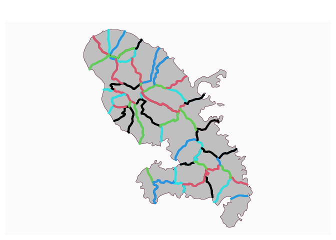

# Get a border layer from polygons

[**Source code**](https://github.com/riatelab/mapsf//tree/master/R/mf_get_borders.R#L18)

## Description

This function extracts borders between contiguous polygons.

## Usage

<pre><code class='language-R'>mf_get_borders(x)
</code></pre>

## Arguments

<table role="presentation">
<tr>
<td style="white-space: nowrap; font-family: monospace; vertical-align: top">
<code id="x">x</code>
</td>
<td>
an sf object of POLYGONS, using a projected CRS
</td>
</tr>
</table>

## Value

An sf object (MULTILINESTRING) of borders is returned.

## Note

If the polygon layer contains topology errors (such as contiguous
polygons not sharing exactly the same boundary) the function may not
return all boundaries correctly. It is possible to use
<code>st_snap()</code> or other functions to try and correct these
errors.

## Examples

``` r
library("mapsf")

mtq <- mf_get_mtq()
mtq_b <- mf_get_borders(mtq)
mf_map(mtq)
mf_map(mtq_b, col = 1:5, lwd = 4, add = TRUE)
```


