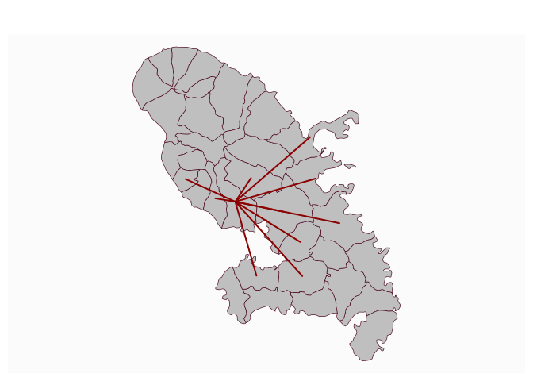

# Get a link layer from a data.frame of links

[**Source code**](https://github.com/riatelab/mapsf//tree/master/R/mf_get_links.R#L25)

## Description

Create a link layer from a data.frame of links and an sf object.

## Usage

<pre><code class='language-R'>mf_get_links(x, df, x_id, df_id)
</code></pre>

## Arguments

<table role="presentation">
<tr>
<td style="white-space: nowrap; font-family: monospace; vertical-align: top">
<code id="x">x</code>
</td>
<td>
an sf object, a simple feature collection.
</td>
</tr>
<tr>
<td style="white-space: nowrap; font-family: monospace; vertical-align: top">
<code id="df">df</code>
</td>
<td>
a data.frame that contains identifiers of starting and ending points.
</td>
</tr>
<tr>
<td style="white-space: nowrap; font-family: monospace; vertical-align: top">
<code id="x_id">x_id</code>
</td>
<td>
name of the identifier variable in x, default to the first column
(optional)
</td>
</tr>
<tr>
<td style="white-space: nowrap; font-family: monospace; vertical-align: top">
<code id="df_id">df_id</code>
</td>
<td>
names of the identifier variables in df, character vector of length 2,
default to the two first columns. (optional)
</td>
</tr>
</table>

## Value

An sf object is returned, it is composed of df and the sfc (LINESTRING)
of links.

## Examples

``` r
library("mapsf")

mtq <- mf_get_mtq()
mob <- read.csv(system.file("csv/mob.csv", package = "mapsf"))
# Select links from Fort-de-France (97209))
mob_97209 <- mob[mob$i == 97209, ]
# Create a link layer
mob_links <- mf_get_links(x = mtq, df = mob_97209)
# Plot the links
mf_map(mtq)
mf_map(mob_links, col = "red4", lwd = 2, add = TRUE)
```


