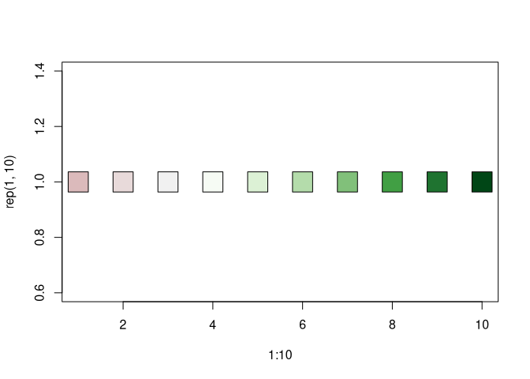
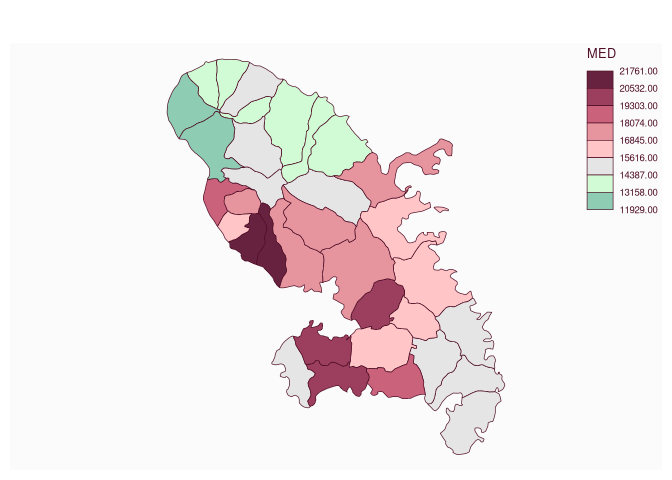
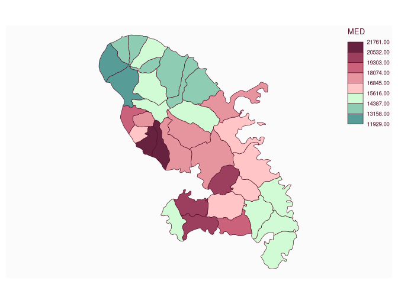

# Get color palettes

[**Source code**](https://github.com/riatelab/mapsf//tree/master/R/mf_get_pal.R#L35)

## Description

<code>mf_get_pal</code> builds sequential, diverging and qualitative
color palettes. Diverging color palettes can be dissymmetric (different
number of colors in each of the two gradients).

## Usage

<pre><code class='language-R'>mf_get_pal(
  n,
  palette,
  alpha = NULL,
  rev = c(FALSE, FALSE),
  neutral,
  breaks,
  mid
)
</code></pre>

## Arguments

<table role="presentation">
<tr>
<td style="white-space: nowrap; font-family: monospace; vertical-align: top">
<code id="n">n</code>
</td>
<td>
the number of colors (\>= 1) to be in the palette
</td>
</tr>
<tr>
<td style="white-space: nowrap; font-family: monospace; vertical-align: top">
<code id="palette">palette</code>
</td>
<td>
a valid palette name. See hcl.pals to get available palette names. The
name is matched to the list of available palettes, ignoring upper
vs. lower case, spaces, dashes, etc. in the matching.
</td>
</tr>
<tr>
<td style="white-space: nowrap; font-family: monospace; vertical-align: top">
<code id="alpha">alpha</code>
</td>
<td>
an alpha-transparency level in the range \[0,1\] (0 means transparent
and 1 means opaque)
</td>
</tr>
<tr>
<td style="white-space: nowrap; font-family: monospace; vertical-align: top">
<code id="rev">rev</code>
</td>
<td>
logical indicating whether the ordering of the colors should be reversed
</td>
</tr>
<tr>
<td style="white-space: nowrap; font-family: monospace; vertical-align: top">
<code id="neutral">neutral</code>
</td>
<td>
a color, if two gradients are used, the ‘neutral’ color can be added
between them
</td>
</tr>
<tr>
<td style="white-space: nowrap; font-family: monospace; vertical-align: top">
<code id="breaks">breaks</code>
</td>
<td>
a vector of class limit
</td>
</tr>
<tr>
<td style="white-space: nowrap; font-family: monospace; vertical-align: top">
<code id="mid">mid</code>
</td>
<td>
a numeric value use to divide the palette in two colors
</td>
</tr>
</table>

## Value

A vector of colors.

## Examples

``` r
library("mapsf")

cls <- mf_get_pal(n = c(3, 7), palette = c("Reds 2", "Greens"))
plot(1:10, rep(1, 10), bg = cls, pch = 22, cex = 4)
```



``` r
mtq <- mf_get_mtq()
bks <- mf_get_breaks(mtq$MED, breaks = "equal", nbreaks = 8)
pal <- mf_get_pal(
  breaks = bks, mid = 15000,
  palette = c("Dark Mint", "Burg"), neutral = "grey90"
)
mf_map(mtq, "MED", "choro", breaks = bks, pal = pal)
```



``` r
pal <- mf_get_pal(breaks = bks, mid = bks[4], palette = c("Dark Mint", "Burg"))
mf_map(mtq, "MED", "choro", breaks = bks, pal = pal)
```


