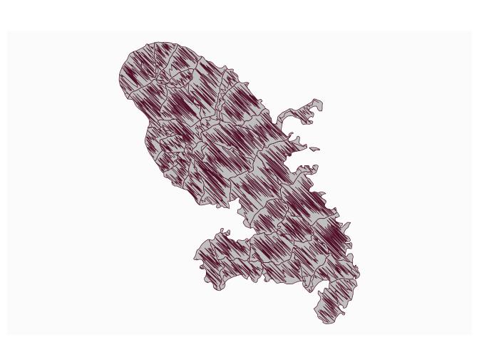

# Get a pencil layer from polygons

[**Source code**](https://github.com/riatelab/mapsf//tree/master/R/mf_get_pencil.R#L20)

## Description

Create a pencil layer. This function transforms a POLYGON or
MULTIPOLYGON sf object into a MULTILINESTRING one.

## Usage

<pre><code class='language-R'>mf_get_pencil(x, size = 100, buffer = 0, lefthanded = TRUE, clip = FALSE)
</code></pre>

## Arguments

<table role="presentation">
<tr>
<td style="white-space: nowrap; font-family: monospace; vertical-align: top">
<code id="x">x</code>
</td>
<td>
an sf object, a simple feature collection (POLYGON or MULTIPOLYGON).
</td>
</tr>
<tr>
<td style="white-space: nowrap; font-family: monospace; vertical-align: top">
<code id="size">size</code>
</td>
<td>
density of the penciling. Median number of points used to build the
MULTILINESTRING.
</td>
</tr>
<tr>
<td style="white-space: nowrap; font-family: monospace; vertical-align: top">
<code id="buffer">buffer</code>
</td>
<td>
buffer around each polygon. This buffer (in map units) is used to take
sample points. A negative value adds a margin between the penciling and
the original polygons borders
</td>
</tr>
<tr>
<td style="white-space: nowrap; font-family: monospace; vertical-align: top">
<code id="lefthanded">lefthanded</code>
</td>
<td>
if TRUE the penciling is done left-handed style.
</td>
</tr>
<tr>
<td style="white-space: nowrap; font-family: monospace; vertical-align: top">
<code id="clip">clip</code>
</td>
<td>
if TRUE, the penciling is cut by the original polygon.
</td>
</tr>
</table>

## Value

A MULTILINESTRING sf object is returned.

## Examples

``` r
library("mapsf")

mtq <- mf_get_mtq()
mtq_pencil <- mf_get_pencil(x = mtq, clip = FALSE)
mf_map(mtq)
mf_map(mtq_pencil, add = TRUE)
```


