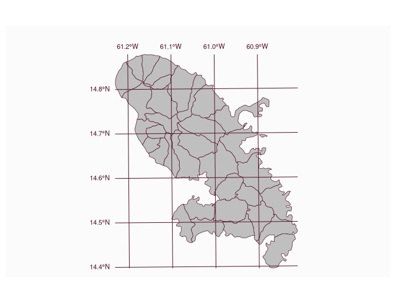
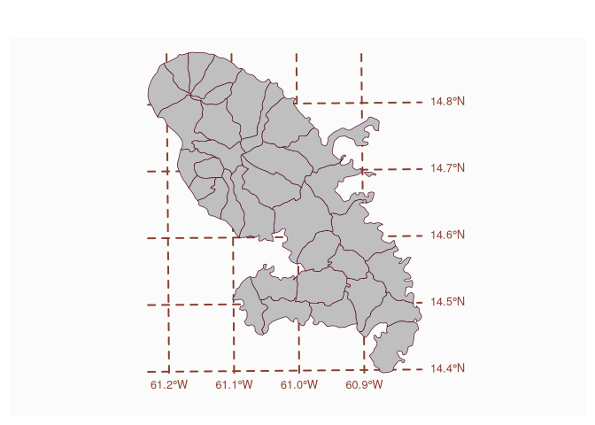

# Plot graticules

[**Source code**](https://github.com/riatelab/mapsf//tree/master/R/mf_graticule.R#L46)

## Description

Display graticules and labels on a map.

## Usage

<pre><code class='language-R'>mf_graticule(
  x,
  col,
  lwd = 1,
  lty = 1,
  expandBB = rep(0, 4),
  label = TRUE,
  pos = c("top", "left"),
  cex = 0.7,
  add = TRUE
)
</code></pre>

## Arguments

<table role="presentation">
<tr>
<td style="white-space: nowrap; font-family: monospace; vertical-align: top">
<code id="x">x</code>
</td>
<td>
object of class <code>sf</code>, <code>sfc</code> or
<code>SpatRaster</code>
</td>
</tr>
<tr>
<td style="white-space: nowrap; font-family: monospace; vertical-align: top">
<code id="col">col</code>
</td>
<td>
graticules and label color
</td>
</tr>
<tr>
<td style="white-space: nowrap; font-family: monospace; vertical-align: top">
<code id="lwd">lwd</code>
</td>
<td>
graticules line width
</td>
</tr>
<tr>
<td style="white-space: nowrap; font-family: monospace; vertical-align: top">
<code id="lty">lty</code>
</td>
<td>
graticules line type
</td>
</tr>
<tr>
<td style="white-space: nowrap; font-family: monospace; vertical-align: top">
<code id="expandBB">expandBB</code>
</td>
<td>
fractional values to expand the bounding box with, in each direction
(bottom, left, top, right)
</td>
</tr>
<tr>
<td style="white-space: nowrap; font-family: monospace; vertical-align: top">
<code id="label">label</code>
</td>
<td>
whether to add labels (TRUE) or not (FALSE)
</td>
</tr>
<tr>
<td style="white-space: nowrap; font-family: monospace; vertical-align: top">
<code id="pos">pos</code>
</td>
<td>
labels positions ("bottom", "left", "top" and / or "right")
</td>
</tr>
<tr>
<td style="white-space: nowrap; font-family: monospace; vertical-align: top">
<code id="cex">cex</code>
</td>
<td>
labels size
</td>
</tr>
<tr>
<td style="white-space: nowrap; font-family: monospace; vertical-align: top">
<code id="add">add</code>
</td>
<td>
whether to add the layer to an existing plot (TRUE) or not (FALSE)
</td>
</tr>
</table>

## Value

An (invisible) layer of graticules is returned (LINESTRING).

## Use of graticules

From <code>st_graticule</code>: "In cartographic visualization, the use
of graticules is not advised, unless the graphical output will be used
for measurement or navigation, or the direction of North is important
for the interpretation of the content, or the content is intended to
display distortions and artifacts created by projection. Unnecessary use
of graticules only adds visual clutter but little relevant information.
Use of coastlines, administrative boundaries or place names permits most
viewers of the output to orient themselves better than a graticule."

## Examples

``` r
library("mapsf")

mtq <- mf_get_mtq()
mf_map(mtq, expandBB = c(0, .1, .1, 0))
mf_graticule(mtq)
```



``` r
mf_graticule(
  x = mtq,
  col = "coral4",
  lwd = 2,
  lty = 2,
  expandBB = c(.1, 0, 0, .1),
  label = TRUE,
  pos = c("right", "bottom"),
  cex = .8,
  add = FALSE
)
mf_map(mtq, add = TRUE)
```


