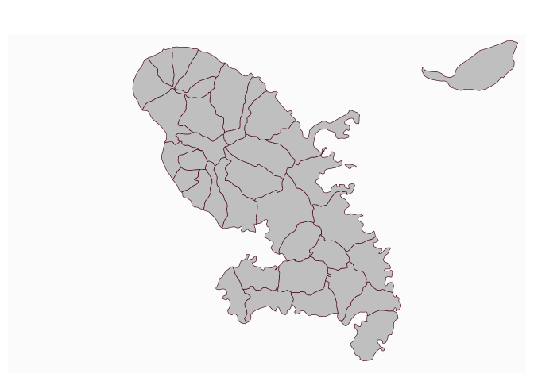
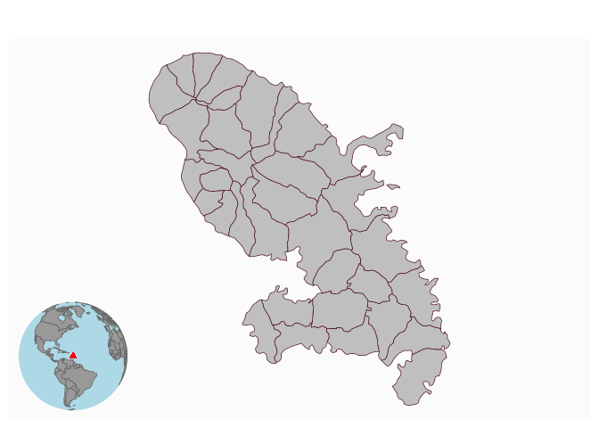
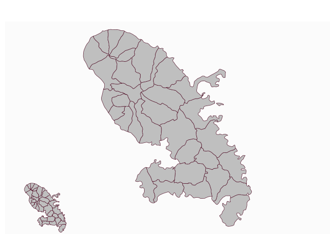

# Plot an inset

[**Source code**](https://github.com/riatelab/mapsf//tree/master/R/mf_inset.R#L37)

## Description

This function is used to add an inset map to the current map.

## Usage

<pre><code class='language-R'>mf_inset_on(x, pos = "topright", cex = 0.2, fig)

mf_inset_off()
</code></pre>

## Arguments

<table role="presentation">
<tr>
<td style="white-space: nowrap; font-family: monospace; vertical-align: top">
<code id="x">x</code>
</td>
<td>
an sf object, or "worldmap" to use with mf_worldmap.
</td>
</tr>
<tr>
<td style="white-space: nowrap; font-family: monospace; vertical-align: top">
<code id="pos">pos</code>
</td>
<td>
position, one of "bottomleft", "left", "topleft", "top", "bottom",
"bottomright", "right", "topright"
</td>
</tr>
<tr>
<td style="white-space: nowrap; font-family: monospace; vertical-align: top">
<code id="cex">cex</code>
</td>
<td>
share of the map width occupied by the inset
</td>
</tr>
<tr>
<td style="white-space: nowrap; font-family: monospace; vertical-align: top">
<code id="fig">fig</code>
</td>
<td>
coordinates of the inset region (in NDC, see in ?par())
</td>
</tr>
</table>

## Details

If x is used (with pos and cex), the width/height ratio of the inset
will match the width/height ratio of x bounding box.<br /> If fig is
used, coordinates (xmin, xmax, ymin, ymax) are expressed as fractions of
the mapping space (i.e. excluding margins).<br /> If map layers have to
be plotted after the inset (i.e after mf_inset_off()), please use add =
TRUE.<br /> It is not possible to plot an inset within an inset.<br />
It is possible to plot anything (base plots) within the inset, not only
map layers.

## Value

No return value, an inset is initiated or closed.

## Examples

``` r
library("mapsf")

mtq <- mf_get_mtq()
mf_map(mtq)
mf_inset_on(x = mtq[1, ], cex = .2)
mf_map(mtq[1, ])
mf_inset_off()
```



``` r
mf_map(mtq)
mf_inset_on(x = "worldmap", pos = "bottomleft")
mf_worldmap(x = mtq)
mf_inset_off()
```



``` r
mf_map(mtq)
mf_inset_on(fig = c(0, 0.25, 0, 0.25))
mf_map(x = mtq)
mf_inset_off()
```


