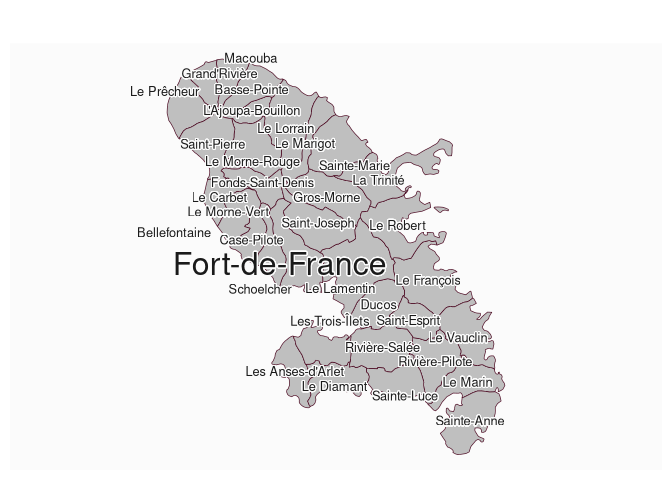

# Plot labels

[**Source code**](https://github.com/riatelab/mapsf//tree/master/R/mf_label.R#L29)

## Description

Put labels on a map.

## Usage

<pre><code class='language-R'>mf_label(
  x,
  var,
  col,
  cex = 0.7,
  overlap = TRUE,
  lines = TRUE,
  halo = FALSE,
  bg,
  r = 0.1,
  q = 1,
  ...
)
</code></pre>

## Arguments

<table role="presentation">
<tr>
<td style="white-space: nowrap; font-family: monospace; vertical-align: top">
<code id="x">x</code>
</td>
<td>
object of class <code>sf</code>
</td>
</tr>
<tr>
<td style="white-space: nowrap; font-family: monospace; vertical-align: top">
<code id="var">var</code>
</td>
<td>
name(s) of the variable(s) to plot
</td>
</tr>
<tr>
<td style="white-space: nowrap; font-family: monospace; vertical-align: top">
<code id="col">col</code>
</td>
<td>
labels color, it can be a single color or a vector of colors
</td>
</tr>
<tr>
<td style="white-space: nowrap; font-family: monospace; vertical-align: top">
<code id="cex">cex</code>
</td>
<td>
labels cex, it can be a single size or a vector of sizes
</td>
</tr>
<tr>
<td style="white-space: nowrap; font-family: monospace; vertical-align: top">
<code id="overlap">overlap</code>
</td>
<td>
if FALSE, labels are moved so they do not overlap.
</td>
</tr>
<tr>
<td style="white-space: nowrap; font-family: monospace; vertical-align: top">
<code id="lines">lines</code>
</td>
<td>
if TRUE, then lines are plotted between x,y and the word, for those
words not covering their x,y coordinate
</td>
</tr>
<tr>
<td style="white-space: nowrap; font-family: monospace; vertical-align: top">
<code id="halo">halo</code>
</td>
<td>
if TRUE, a ‘halo’ is displayed around the text and additional arguments
bg and r can be modified to set the color and width of the halo.
</td>
</tr>
<tr>
<td style="white-space: nowrap; font-family: monospace; vertical-align: top">
<code id="bg">bg</code>
</td>
<td>
halo color, it can be a single color or a vector of colors
</td>
</tr>
<tr>
<td style="white-space: nowrap; font-family: monospace; vertical-align: top">
<code id="r">r</code>
</td>
<td>
width of the halo, it can be a single value or a vector of values
</td>
</tr>
<tr>
<td style="white-space: nowrap; font-family: monospace; vertical-align: top">
<code id="q">q</code>
</td>
<td>
quality of the non overlapping labels placement. Possible values are 0
(quick results), 1 (reasonable quality and speed), 2 (better quality), 3
(insane quality, can take a lot of time).
</td>
</tr>
<tr>
<td style="white-space: nowrap; font-family: monospace; vertical-align: top">
<code id="...">…</code>
</td>
<td>
further text arguments.
</td>
</tr>
</table>

## Value

No return value, labels are displayed.

## Examples

``` r
library("mapsf")

mtq <- mf_get_mtq()
mf_map(mtq)
mtq$cex <- c(rep(.8, 8), 2, rep(.8, 25))
mf_label(
  x = mtq, var = "LIBGEO",
  col = "grey10", halo = TRUE, cex = mtq$cex,
  overlap = FALSE, lines = FALSE
)
```


