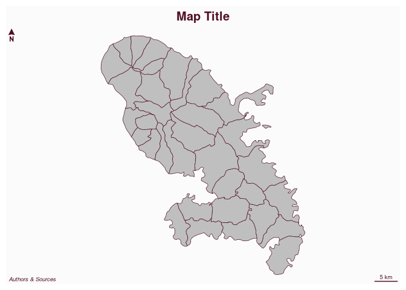

# Plot a map layout

[**Source code**](https://github.com/riatelab/mapsf//tree/master/R/mf_layout.R#L20)

## Description

Plot a map layout (title, credits, scalebar, north arrow, frame).

This function uses <code>mf_title</code>, <code>mf_credits</code>,
<code>mf_scale</code> and <code>mf_arrow</code> with default values.

## Usage

<pre><code class='language-R'>mf_layout(
  title = "Map Title",
  credits = "Authors &amp; Sources",
  scale = TRUE,
  arrow = TRUE,
  frame = FALSE
)
</code></pre>

## Arguments

<table role="presentation">
<tr>
<td style="white-space: nowrap; font-family: monospace; vertical-align: top">
<code id="title">title</code>
</td>
<td>
title of the map
</td>
</tr>
<tr>
<td style="white-space: nowrap; font-family: monospace; vertical-align: top">
<code id="credits">credits</code>
</td>
<td>
credits
</td>
</tr>
<tr>
<td style="white-space: nowrap; font-family: monospace; vertical-align: top">
<code id="scale">scale</code>
</td>
<td>
display a scale bar
</td>
</tr>
<tr>
<td style="white-space: nowrap; font-family: monospace; vertical-align: top">
<code id="arrow">arrow</code>
</td>
<td>
display an arrow
</td>
</tr>
<tr>
<td style="white-space: nowrap; font-family: monospace; vertical-align: top">
<code id="frame">frame</code>
</td>
<td>
display a frame
</td>
</tr>
</table>

## Value

No return value, a map layout is displayed.

## Examples

``` r
library("mapsf")

mtq <- mf_get_mtq()
mf_map(mtq)
mf_layout()
```


