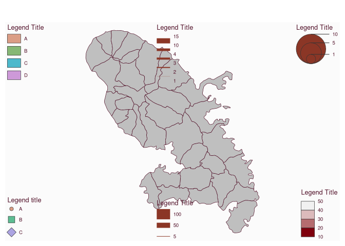

# Plot a legend

[**Source code**](https://github.com/riatelab/mapsf//tree/master/R/mf_legend.R#L104)

## Description

Plot different types of legend. The "type" argument defines the legend
type. Please note that some arguments are available for all types of
legend and some others are only relevant for specific legend types (see
Details). <code>mf_legend()</code> is a wrapper for
<code>maplegend::leg()</code>.

## Usage

<pre><code class='language-R'>mf_legend(
  type,
  val,
  pos = "left",
  pal = "Inferno",
  alpha = 1,
  col = "tomato4",
  inches = 0.3,
  symbol = "circle",
  self_adjust = FALSE,
  lwd = 0.7,
  border = "#333333",
  pch = seq_along(val),
  cex = rep(1, length(val)),
  title = "Legend Title",
  title_cex = 0.8 * size,
  val_cex = 0.6 * size,
  val_rnd = 0,
  col_na = "white",
  cex_na = 1,
  pch_na = 4,
  no_data = FALSE,
  no_data_txt = "No Data",
  box_border = "#333333",
  box_cex = c(1, 1),
  horiz = FALSE,
  frame_border,
  frame = FALSE,
  bg,
  fg,
  size = 1,
  return_bbox = FALSE,
  adj = c(0, 0)
)
</code></pre>

## Arguments

<table role="presentation">
<tr>
<td style="white-space: nowrap; font-family: monospace; vertical-align: top">
<code id="type">type</code>
</td>
<td>

type of legend:

<ul>
<li>

<strong>prop</strong> for proportional symbols,

</li>
<li>

<strong>choro</strong> for choropleth maps,

</li>
<li>

<strong>cont</strong> for continuous maps (e.g. raster),

</li>
<li>

<strong>typo</strong> for typology maps,

</li>
<li>

<strong>symb</strong> for symbols maps,

</li>
<li>

<strong>prop_line</strong> for proportional lines maps,

</li>
<li>

<strong>grad_line</strong> for graduated lines maps.

</li>
</ul>
</td>
</tr>
<tr>
<td style="white-space: nowrap; font-family: monospace; vertical-align: top">
<code id="val">val</code>
</td>
<td>
vector of value(s) (for "prop" and "prop_line", at least c(min, max) for
"cont"), vector of categories (for "symb" and "typo"), break labels (for
"choro" and "grad_line").
</td>
</tr>
<tr>
<td style="white-space: nowrap; font-family: monospace; vertical-align: top">
<code id="pos">pos</code>
</td>
<td>
position of the legend. It can be one of ‘topleft’, ‘top’, ‘topright’,
‘right’, ‘bottomright’, ‘bottom’,‘bottomleft’, ‘left’, ‘interactive’ or
a vector of two coordinates in map units (c(x, y)).
</td>
</tr>
<tr>
<td style="white-space: nowrap; font-family: monospace; vertical-align: top">
<code id="pal">pal</code>
</td>
<td>
a color palette name or a vector of colors
</td>
</tr>
<tr>
<td style="white-space: nowrap; font-family: monospace; vertical-align: top">
<code id="alpha">alpha</code>
</td>
<td>
if <code>pal</code> is a hcl.colors palette name, the alpha-transparency
level in the range \[0,1\]
</td>
</tr>
<tr>
<td style="white-space: nowrap; font-family: monospace; vertical-align: top">
<code id="col">col</code>
</td>
<td>
color of the symbols (for "prop") or color of the lines (for "prop_line"
and "grad_line")
</td>
</tr>
<tr>
<td style="white-space: nowrap; font-family: monospace; vertical-align: top">
<code id="inches">inches</code>
</td>
<td>
size of the largest symbol (radius for circles, half width for squares)
in inches
</td>
</tr>
<tr>
<td style="white-space: nowrap; font-family: monospace; vertical-align: top">
<code id="symbol">symbol</code>
</td>
<td>
type of symbols, ‘circle’ or ‘square’
</td>
</tr>
<tr>
<td style="white-space: nowrap; font-family: monospace; vertical-align: top">
<code id="self_adjust">self_adjust</code>
</td>
<td>
if TRUE values are self-adjusted to keep min, max and intermediate
rounded values
</td>
</tr>
<tr>
<td style="white-space: nowrap; font-family: monospace; vertical-align: top">
<code id="lwd">lwd</code>
</td>
<td>
width(s) of the symbols borders (for "prop" and "symb"), width of the
largest line (for "prop_line"), vector of line width (for "grad_line")
</td>
</tr>
<tr>
<td style="white-space: nowrap; font-family: monospace; vertical-align: top">
<code id="border">border</code>
</td>
<td>
symbol border color(s)
</td>
</tr>
<tr>
<td style="white-space: nowrap; font-family: monospace; vertical-align: top">
<code id="pch">pch</code>
</td>
<td>
type(s) of the symbols (0:25)
</td>
</tr>
<tr>
<td style="white-space: nowrap; font-family: monospace; vertical-align: top">
<code id="cex">cex</code>
</td>
<td>
size(s) of the symbols
</td>
</tr>
<tr>
<td style="white-space: nowrap; font-family: monospace; vertical-align: top">
<code id="title">title</code>
</td>
<td>
title of the legend
</td>
</tr>
<tr>
<td style="white-space: nowrap; font-family: monospace; vertical-align: top">
<code id="title_cex">title_cex</code>
</td>
<td>
size of the legend title
</td>
</tr>
<tr>
<td style="white-space: nowrap; font-family: monospace; vertical-align: top">
<code id="val_cex">val_cex</code>
</td>
<td>
size of the values in the legend
</td>
</tr>
<tr>
<td style="white-space: nowrap; font-family: monospace; vertical-align: top">
<code id="val_rnd">val_rnd</code>
</td>
<td>
number of decimal places of the values in the legend
</td>
</tr>
<tr>
<td style="white-space: nowrap; font-family: monospace; vertical-align: top">
<code id="col_na">col_na</code>
</td>
<td>
color for missing values
</td>
</tr>
<tr>
<td style="white-space: nowrap; font-family: monospace; vertical-align: top">
<code id="cex_na">cex_na</code>
</td>
<td>
size of the symbols for missing values
</td>
</tr>
<tr>
<td style="white-space: nowrap; font-family: monospace; vertical-align: top">
<code id="pch_na">pch_na</code>
</td>
<td>
type of the symbols for missing values
</td>
</tr>
<tr>
<td style="white-space: nowrap; font-family: monospace; vertical-align: top">
<code id="no_data">no_data</code>
</td>
<td>
if TRUE a "missing value" box is plotted
</td>
</tr>
<tr>
<td style="white-space: nowrap; font-family: monospace; vertical-align: top">
<code id="no_data_txt">no_data_txt</code>
</td>
<td>
label for missing values
</td>
</tr>
<tr>
<td style="white-space: nowrap; font-family: monospace; vertical-align: top">
<code id="box_border">box_border</code>
</td>
<td>
border color of legend boxes
</td>
</tr>
<tr>
<td style="white-space: nowrap; font-family: monospace; vertical-align: top">
<code id="box_cex">box_cex</code>
</td>
<td>
width and height size expansion of boxes, (or offset between circles for
"prop" legends with horiz = TRUE)
</td>
</tr>
<tr>
<td style="white-space: nowrap; font-family: monospace; vertical-align: top">
<code id="horiz">horiz</code>
</td>
<td>
if TRUE plot an horizontal legend
</td>
</tr>
<tr>
<td style="white-space: nowrap; font-family: monospace; vertical-align: top">
<code id="frame_border">frame_border</code>
</td>
<td>
border color of the frame
</td>
</tr>
<tr>
<td style="white-space: nowrap; font-family: monospace; vertical-align: top">
<code id="frame">frame</code>
</td>
<td>
if TRUE the legend is plotted within a frame
</td>
</tr>
<tr>
<td style="white-space: nowrap; font-family: monospace; vertical-align: top">
<code id="bg">bg</code>
</td>
<td>
background color of the legend
</td>
</tr>
<tr>
<td style="white-space: nowrap; font-family: monospace; vertical-align: top">
<code id="fg">fg</code>
</td>
<td>
foreground color of the legend
</td>
</tr>
<tr>
<td style="white-space: nowrap; font-family: monospace; vertical-align: top">
<code id="size">size</code>
</td>
<td>
size of the legend; 2 means two times bigger
</td>
</tr>
<tr>
<td style="white-space: nowrap; font-family: monospace; vertical-align: top">
<code id="return_bbox">return_bbox</code>
</td>
<td>
return only bounding box of the legend. No legend is plotted.
</td>
</tr>
<tr>
<td style="white-space: nowrap; font-family: monospace; vertical-align: top">
<code id="adj">adj</code>
</td>
<td>
adjust the postion of the legend in x and y directions
</td>
</tr>
</table>

## Details

Some arguments are available for all types of legend: <code>val</code>,
<code>pos</code>, <code>title</code>, <code>title_cex</code>,
<code>val_cex</code>, <code>frame</code>, <code>bg</code>,
<code>fg</code>, <code>size</code>, <code>adj</code>,
<code>return_bbox</code>).

Relevant arguments for each specific legend types:

<ul>
<li>

<code>mf_legend(type = “prop”, val, inches, symbol, col, lwd, border,
val_rnd, self_adjust, horiz)</code>

</li>
<li>

<code>mf_legend(type = “choro”, val, pal, val_rnd, col_na, no_data,
no_data_txt, box_border, horiz)</code>

</li>
<li>

<code>mf_legend(type = “cont”, val, pal, val_rnd, col_na, no_data,
no_data_txt, box_border, horiz)</code>

</li>
<li>

<code>mf_legend(type = “typo”, val, pal, col_na, no_data, no_data_txt,
box_border)</code>

</li>
<li>

<code>mf_legend(type = “symb”, val, pal, pch, cex, lwd, pch_na, cex_na,
col_na, no_data, no_data_txt)</code>

</li>
<li>

<code>mf_legend(type = “prop_line”, val, col, lwd, val_rnd)</code>

</li>
<li>

<code>mf_legend(type = “grad_line”, val, col, lwd, val_rnd)</code>

</li>
</ul>

## Value

No value is returned, a legend is displayed (except if
<code>return_bbox</code> is used).

## Examples

``` r
library("mapsf")

mtq <- mf_get_mtq()
mf_map(mtq)
mf_legend(type = "prop", pos = "topright", val = c(1, 5, 10), inches = .3)
mf_legend(
  type = "choro", pos = "bottomright", val = c(10, 20, 30, 40, 50),
  pal = hcl.colors(4, "Reds 2")
)
mf_legend(
  type = "typo", pos = "topleft", val = c("A", "B", "C", "D"),
  pal = hcl.colors(4, "Dynamic")
)
mf_legend(
  type = "symb", pos = "bottomleft", val = c("A", "B", "C"),
  pch = 21:23, cex = c(1, 2, 2),
  pal = hcl.colors(3, "Dynamic")
)
mf_legend(
  type = "grad_line", pos = "top", val = c(1, 2, 3, 4, 10, 15),
  lwd = c(0.2, 2, 4, 5, 10)
)
mf_legend(type = "prop_line", pos = "bottom", lwd = 20, val = c(5, 50, 100))
```


