# Plot a map

[**Source code**](https://github.com/riatelab/mapsf//tree/master/R/mf_map.R#L368)

## Description

<code>mf_map()</code> is the main function of the package, it displays
map layers on a georeferenced plot.

<code>mf_map()</code> has three main arguments:

<ul>
<li>

<code>x</code>, an sf object;

</li>
<li>

<code>var</code>, the name(s) of a variable(s) to map;

</li>
<li>

<code>type</code>, the map layer type.

</li>
</ul>

Many parameters are available to fine tune symbologies and legends.

Relevant arguments and default values are different for each map type
and are described in the "Details" section.

## Usage

<pre><code class='language-R'>mf_map(x, var, type = "base",
       breaks, nbreaks, pal, alpha, rev, inches, val_max, symbol, col,
       lwd_max, val_order, pch, cex, border, lwd, col_na, cex_na, pch_na,
       expandBB, add,
       leg_pos, leg_title, leg_title_cex, leg_val_cex, leg_val_rnd,
       leg_no_data, leg_frame, leg_frame_border, leg_horiz, leg_adj, leg_bg,
       leg_fg, leg_size, leg_border, leg_box_border, leg_box_cex, ...)
</code></pre>

## Arguments

<table role="presentation">
<tr>
<td style="white-space: nowrap; font-family: monospace; vertical-align: top">
<code id="x">x</code>
</td>
<td>
object of class <code>sf</code> or <code>sfc</code>
</td>
</tr>
<tr>
<td style="white-space: nowrap; font-family: monospace; vertical-align: top">
<code id="var">var</code>
</td>
<td>
name(s) of the variable(s) to plot
</td>
</tr>
<tr>
<td style="white-space: nowrap; font-family: monospace; vertical-align: top">
<code id="type">type</code>
</td>
<td>
<ul>
<li>

<strong>base</strong>: base maps

</li>
<li>

<strong>prop</strong>: proportional symbols maps

</li>
<li>

<strong>choro</strong>: choropleth maps

</li>
<li>

<strong>typo</strong>: typology maps

</li>
<li>

<strong>symb</strong>: symbols maps

</li>
<li>

<strong>grad</strong>: graduated symbols maps

</li>
<li>

<strong>prop_choro</strong>: proportional symbols maps with symbols
colors based on a quantitative data classification

</li>
<li>

<strong>prop_typo</strong>: proportional symbols maps with symbols
colors based on qualitative data

</li>
<li>

<strong>symb_choro</strong>: symbols maps with symbols colors based on a
quantitative data classification

</li>
</ul>
</td>
</tr>
<tr>
<td style="white-space: nowrap; font-family: monospace; vertical-align: top">
<code id="breaks">breaks</code>
</td>
<td>
either a numeric vector with the actual breaks, or a classification
method name (see mf_get_breaks and Details)
</td>
</tr>
<tr>
<td style="white-space: nowrap; font-family: monospace; vertical-align: top">
<code id="nbreaks">nbreaks</code>
</td>
<td>
number of classes
</td>
</tr>
<tr>
<td style="white-space: nowrap; font-family: monospace; vertical-align: top">
<code id="pal">pal</code>
</td>
<td>
a set of colors or a palette name (from hcl.colors)
</td>
</tr>
<tr>
<td style="white-space: nowrap; font-family: monospace; vertical-align: top">
<code id="alpha">alpha</code>
</td>
<td>
opacity, in the range \[0,1\]
</td>
</tr>
<tr>
<td style="white-space: nowrap; font-family: monospace; vertical-align: top">
<code id="rev">rev</code>
</td>
<td>
if <code>pal</code> is a hcl.colors palette name, whether the ordering
of the colors should be reversed (TRUE) or not (FALSE)
</td>
</tr>
<tr>
<td style="white-space: nowrap; font-family: monospace; vertical-align: top">
<code id="inches">inches</code>
</td>
<td>
size of the biggest symbol (radius for circles, half width for squares)
in inches.
</td>
</tr>
<tr>
<td style="white-space: nowrap; font-family: monospace; vertical-align: top">
<code id="val_max">val_max</code>
</td>
<td>
maximum value used for proportional symbols
</td>
</tr>
<tr>
<td style="white-space: nowrap; font-family: monospace; vertical-align: top">
<code id="symbol">symbol</code>
</td>
<td>
type of symbols, ‘circle’ or ‘square’
</td>
</tr>
<tr>
<td style="white-space: nowrap; font-family: monospace; vertical-align: top">
<code id="col">col</code>
</td>
<td>
color
</td>
</tr>
<tr>
<td style="white-space: nowrap; font-family: monospace; vertical-align: top">
<code id="lwd_max">lwd_max</code>
</td>
<td>
line width of the largest line
</td>
</tr>
<tr>
<td style="white-space: nowrap; font-family: monospace; vertical-align: top">
<code id="val_order">val_order</code>
</td>
<td>
values order, a character vector that matches var modalities
</td>
</tr>
<tr>
<td style="white-space: nowrap; font-family: monospace; vertical-align: top">
<code id="pch">pch</code>
</td>
<td>
point type
</td>
</tr>
<tr>
<td style="white-space: nowrap; font-family: monospace; vertical-align: top">
<code id="cex">cex</code>
</td>
<td>
point size
</td>
</tr>
<tr>
<td style="white-space: nowrap; font-family: monospace; vertical-align: top">
<code id="border">border</code>
</td>
<td>
border color
</td>
</tr>
<tr>
<td style="white-space: nowrap; font-family: monospace; vertical-align: top">
<code id="lwd">lwd</code>
</td>
<td>
border width
</td>
</tr>
<tr>
<td style="white-space: nowrap; font-family: monospace; vertical-align: top">
<code id="col_na">col_na</code>
</td>
<td>
color for missing values
</td>
</tr>
<tr>
<td style="white-space: nowrap; font-family: monospace; vertical-align: top">
<code id="cex_na">cex_na</code>
</td>
<td>
point size for NA values
</td>
</tr>
<tr>
<td style="white-space: nowrap; font-family: monospace; vertical-align: top">
<code id="pch_na">pch_na</code>
</td>
<td>
point type for NA values
</td>
</tr>
<tr>
<td style="white-space: nowrap; font-family: monospace; vertical-align: top">
<code id="expandBB">expandBB</code>
</td>
<td>
fractional values to expand the bounding box with, in each direction
(bottom, left, top, right)
</td>
</tr>
<tr>
<td style="white-space: nowrap; font-family: monospace; vertical-align: top">
<code id="add">add</code>
</td>
<td>
whether to add the layer to an existing plot (TRUE) or not (FALSE)
</td>
</tr>
<tr>
<td style="white-space: nowrap; font-family: monospace; vertical-align: top">
<code id="leg_pos">leg_pos</code>
</td>
<td>
position of the legend, one of ‘topleft’, ‘top’,‘topright’, ‘right’,
‘bottomright’, ‘bottom’, ‘bottomleft’, ‘left’ or a vector of two
coordinates in map units (c(x, y)). If leg_pos = NA then the legend is
not plotted. If leg_pos = ‘interactive’ click onthe map to choose the
legend position.
</td>
</tr>
<tr>
<td style="white-space: nowrap; font-family: monospace; vertical-align: top">
<code id="leg_title">leg_title</code>
</td>
<td>
legend title
</td>
</tr>
<tr>
<td style="white-space: nowrap; font-family: monospace; vertical-align: top">
<code id="leg_title_cex">leg_title_cex</code>
</td>
<td>
size of the legend title
</td>
</tr>
<tr>
<td style="white-space: nowrap; font-family: monospace; vertical-align: top">
<code id="leg_val_cex">leg_val_cex</code>
</td>
<td>
size of the values in the legend
</td>
</tr>
<tr>
<td style="white-space: nowrap; font-family: monospace; vertical-align: top">
<code id="leg_val_rnd">leg_val_rnd</code>
</td>
<td>
number of decimal places of the values in the legend
</td>
</tr>
<tr>
<td style="white-space: nowrap; font-family: monospace; vertical-align: top">
<code id="leg_no_data">leg_no_data</code>
</td>
<td>
label for missing values
</td>
</tr>
<tr>
<td style="white-space: nowrap; font-family: monospace; vertical-align: top">
<code id="leg_frame">leg_frame</code>
</td>
<td>
whether to add a frame to the legend (TRUE) or not (FALSE)
</td>
</tr>
<tr>
<td style="white-space: nowrap; font-family: monospace; vertical-align: top">
<code id="leg_frame_border">leg_frame_border</code>
</td>
<td>
border color of the legend frame
</td>
</tr>
<tr>
<td style="white-space: nowrap; font-family: monospace; vertical-align: top">
<code id="leg_horiz">leg_horiz</code>
</td>
<td>
display the legend horizontally (for proportional symbols and choropleth
types)
</td>
</tr>
<tr>
<td style="white-space: nowrap; font-family: monospace; vertical-align: top">
<code id="leg_adj">leg_adj</code>
</td>
<td>
adjust the postion of the legend in x and y directions
</td>
</tr>
<tr>
<td style="white-space: nowrap; font-family: monospace; vertical-align: top">
<code id="leg_bg">leg_bg</code>
</td>
<td>
color of the legend backgournd
</td>
</tr>
<tr>
<td style="white-space: nowrap; font-family: monospace; vertical-align: top">
<code id="leg_fg">leg_fg</code>
</td>
<td>
color of the legend foreground
</td>
</tr>
<tr>
<td style="white-space: nowrap; font-family: monospace; vertical-align: top">
<code id="leg_size">leg_size</code>
</td>
<td>
size of the legend; 2 means two times bigger
</td>
</tr>
<tr>
<td style="white-space: nowrap; font-family: monospace; vertical-align: top">
<code id="leg_border">leg_border</code>
</td>
<td>
symbol border color(s)
</td>
</tr>
<tr>
<td style="white-space: nowrap; font-family: monospace; vertical-align: top">
<code id="leg_box_border">leg_box_border</code>
</td>
<td>
border color of legend boxes
</td>
</tr>
<tr>
<td style="white-space: nowrap; font-family: monospace; vertical-align: top">
<code id="leg_box_cex">leg_box_cex</code>
</td>
<td>
width and height size expansion of boxes
</td>
</tr>
<tr>
<td style="white-space: nowrap; font-family: monospace; vertical-align: top">
<code id="...">…</code>
</td>
<td>
ignored
</td>
</tr>
</table>

## Details

<h4>
Relevant arguments and default values for each map types:
</h4>

<strong>base</strong>: displays sf objects geometries.

<pre>
mf_map(x, col = "grey80", pch = 20, cex = 1, border = "grey20",
       lwd = 0.7, alpha = NULL, expandBB, add = FALSE, ...)
       </pre>

<strong>prop</strong>: displays symbols with areas proportional to a
quantitative variable (stocks). <code>inches</code> is used to set
symbols sizes.

<pre>
mf_map(x, var, type = "prop", inches = 0.3, val_max, symbol = "circle",
       col = "tomato4", alpha = NULL, lwd_max = 20,
       border = getOption("mapsf.fg"), lwd = 0.7, expandBB, add = TRUE,
       leg_pos = mf_get_leg_pos(x), leg_title = var,
       leg_title_cex = 0.8, leg_val_cex = 0.6, leg_val_rnd = 0,
       leg_frame = FALSE, leg_frame_border = getOption("mapsf.fg"),
       leg_horiz = FALSE, leg_adj = c(0, 0),
       leg_bg = getOption("mapsf.bg"), leg_fg = getOption("mapsf.fg"),
       leg_size = 1)
       </pre>

<strong>choro</strong>: areas are shaded according to the variation of a
quantitative variable. Choropleth maps are used to represent ratios or
indices. <code>nbreaks</code>, and <code>breaks</code> allow to set the
variable classification. Colors palettes, defined with <code>pal</code>,
can be created with <code>mf_get_pal()</code> or can use palette names
from <code>hcl.pals()</code>.

<pre>
mf_map(x, var, type = "choro", breaks = "quantile", nbreaks, pal = "Mint",
       alpha = NULL, rev = FALSE, pch = 21, cex = 1,
       border = getOption("mapsf.fg"), lwd = 0.7, col_na = "white",
       cex_na = 1, pch_na = 4, expandBB, add = FALSE,
       leg_pos = mf_get_leg_pos(x), leg_title = var, leg_title_cex = 0.8,
       leg_val_cex = 0.6, leg_val_rnd = 2, leg_no_data = "No data",
       leg_frame = FALSE, leg_frame_border = getOption("mapsf.fg"),
       leg_horiz = FALSE, leg_adj = c(0, 0), leg_bg = getOption("mapsf.bg"),
       leg_fg = getOption("mapsf.fg"), leg_size = 1,
       leg_box_border = getOption("mapsf.fg"), leg_box_cex = c(1, 1))
       </pre>

<strong>typo</strong>: displays a typology map of a qualitative
variable. <code>val_order</code> is used to set modalities order in the
legend.

<pre>
mf_map(x, var, type = "typo", pal = "Dynamic", alpha = NULL, rev = FALSE,
       val_order,border = getOption("mapsf.fg"), pch = 21, cex = 2,
       lwd = 0.7, cex_na = 1, pch_na = 4, col_na = "white",
       leg_pos = mf_get_leg_pos(x), leg_title = var, leg_title_cex = 0.8,
       leg_val_cex = 0.6, leg_no_data = "No data", leg_frame = FALSE,
       leg_frame_border = getOption("mapsf.fg"), leg_adj = c(0, 0),
       leg_size = 1, leg_box_border = getOption("mapsf.fg"),
       leg_box_cex = c(1, 1), leg_fg = getOption("mapsf.fg"),
       leg_bg = getOption("mapsf.bg"), add = FALSE)
       </pre>

<strong>symb</strong>: displays the different modalities of a
qualitative variable as symbols.

<pre>
mf_map(x, var, type = "symb", pal = "Dynamic", alpha = NULL, rev = FALSE,
       border = getOption("mapsf.fg"), pch, cex = 2, lwd = 0.7,
       col_na = "grey", pch_na = 4, cex_na = 1, val_order,
       leg_pos = mf_get_leg_pos(x), leg_title = var, leg_title_cex = 0.8,
       leg_val_cex = 0.6, leg_val_rnd = 2, leg_no_data = "No data",
       leg_frame = FALSE, leg_frame_border = getOption("mapsf.fg"),
       leg_adj = c(0, 0), leg_fg = getOption("mapsf.fg"),
       leg_bg = getOption("mapsf.bg"), leg_size = 1, add = TRUE)
       </pre>

<strong>grad</strong>: displays graduated symbols. Sizes classes are set
with <code>breaks</code> and <code>nbreaks</code>. Symbol sizes are set
with <code>cex</code>.

<pre>
mf_map(x, var, type = "grad", breaks = "quantile", nbreaks = 3, col = "tomato4",
       alpha = NULL, border = getOption("mapsf.fg"), pch = 21, cex, lwd,
       leg_pos = mf_get_leg_pos(x), leg_title = var, leg_title_cex = 0.8,
       leg_val_cex = 0.6, leg_val_rnd = 2, leg_frame = FALSE,
       leg_adj = c(0, 0), leg_size = 1, leg_border = border,
       leg_box_cex = c(1, 1), leg_fg = getOption("mapsf.fg"),
       leg_bg = getOption("mapsf.bg"), leg_frame_border = getOption("mapsf.fg"),
       add = TRUE)
       </pre>

<strong>prop_choro</strong>: displays symbols with sizes proportional to
values of a first variable and colored to reflect the classification of
a second quantitative variable.

<pre>
mf_map(x, var, type = "prop_choro", inches = 0.3, val_max, symbol = "circle",
       pal = "Mint", alpha = NULL, rev = FALSE, breaks = "quantile", nbreaks,
       border = getOption("mapsf.fg"), lwd = 0.7, col_na = "white",
       leg_pos = mf_get_leg_pos(x, 1), leg_title = var,
       leg_title_cex = c(0.8, 0.8), leg_val_cex = c(0.6, 0.6),
       leg_val_rnd = c(0, 2), leg_no_data = "No data",
       leg_frame = c(FALSE, FALSE), leg_frame_border = getOption("mapsf.fg"),
       leg_horiz = c(FALSE, FALSE), leg_adj = c(0, 0),
       leg_fg = getOption("mapsf.fg"), leg_bg = getOption("mapsf.bg"),
       leg_size = 1, leg_box_border = getOption("mapsf.fg"),
       leg_box_cex = c(1, 1), add = TRUE)
       </pre>

<strong>prop_typo</strong>: displays symbols with sizes proportional to
values of a first variable and colored to reflect the modalities of a
second qualitative variable.

<pre>
mf_map(x, var, type = "prop_typo", inches = 0.3, val_max, symbol = "circle",
       pal = "Dynamic", alpha = NULL, rev = FALSE, val_order,
       border = getOption("mapsf.fg"), lwd = 0.7, lwd_max = 15,
       col_na = "white",
       leg_pos = mf_get_leg_pos(x, 1), leg_title = var,
       leg_title_cex = c(0.8, 0.8), leg_val_cex = c(0.6, 0.6),
       leg_val_rnd = c(0), leg_no_data = "No data", leg_frame = c(FALSE, FALSE),
       leg_frame_border = getOption("mapsf.fg"), leg_horiz = FALSE,
       leg_adj = c(0, 0), leg_fg = getOption("mapsf.fg"),
       leg_bg = getOption("mapsf.bg"), leg_size = 1,
       leg_box_border = getOption("mapsf.fg"), leg_box_cex = c(1, 1),
       add = TRUE)
       </pre>

<strong>symb_choro</strong>: displays the different modalities of a
first qualitative variable as symbols colored to reflect the
classification of a second quantitative variable.

<pre>
mf_map(x, var, type = "symb_choro", pal = "Mint", alpha = NULL, rev = FALSE,
       breaks = "quantile", nbreaks, border = getOption("mapsf.fg"),
       pch, cex = 2, lwd = 0.7, pch_na = 4, cex_na = 1, col_na = "white",
       val_order,
       leg_pos = mf_get_leg_pos(x, 1), leg_title = var,
       leg_title_cex = c(0.8, 0.8), leg_val_cex = c(0.6, 0.6),
       leg_val_rnd = 2, leg_no_data = c("No data", "No data"),
       leg_frame = c(FALSE, FALSE), leg_frame_border = getOption("mapsf.fg"),
       leg_horiz = FALSE, leg_adj = c(0, 0), leg_fg = getOption("mapsf.fg"),
       leg_bg = getOption("mapsf.bg"), leg_size = 1,
       leg_box_border = getOption("mapsf.fg"), leg_box_cex = c(1, 1),
       add = TRUE)
       </pre>
<h4>
Class boundaries
</h4>

Breaks defined by a numeric vector or a classification method are
left-closed: breaks defined by <code>c(2, 5, 10, 15, 20)</code> will be
mapped as \[2 - 5\[, \[5 - 10\[, \[10 - 15\[, \[15 - 20\].

## Value

x is (invisibly) returned.

## Examples

``` r
library("mapsf")

mtq <- mf_get_mtq()
# basic examples
# type = "base"
mf_map(mtq)
# type = "prop"
mf_map(mtq)
mf_map(mtq, var = "POP", type = "prop")
```

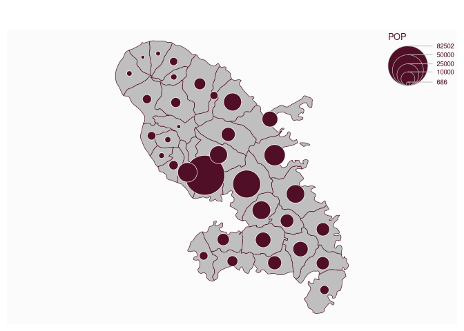

``` r
# type = "choro"
mf_map(mtq, var = "MED", type = "choro")
```

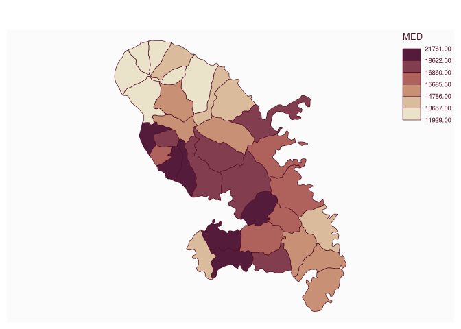

``` r
# type = "typo"
mf_map(mtq, "STATUS", "typo")
```

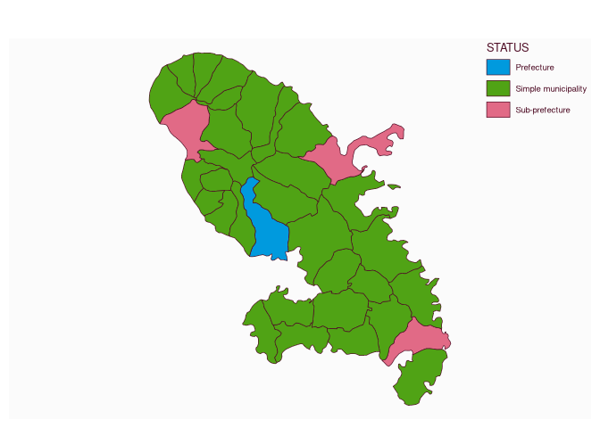

``` r
# type = "symb"
mf_map(mtq)
mf_map(mtq, "STATUS", "symb")
```

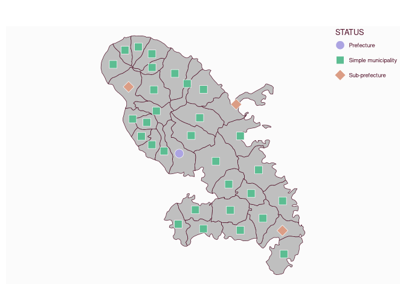

``` r
# type = "grad"
mf_map(mtq)
mf_map(mtq, var = "POP", type = "grad")
```

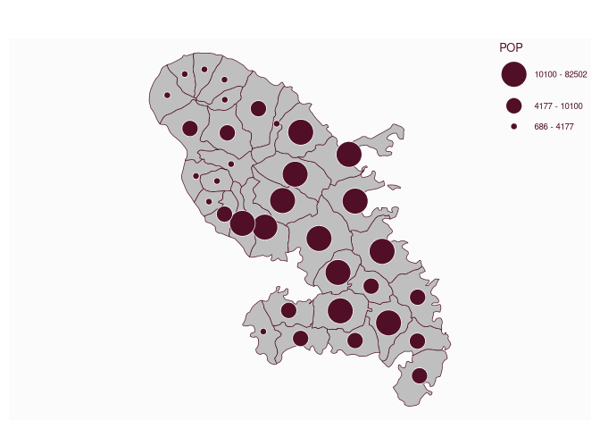

``` r
# type = "prop_choro"
mf_map(mtq)
mf_map(mtq, var = c("POP", "MED"), type = "prop_choro")
```

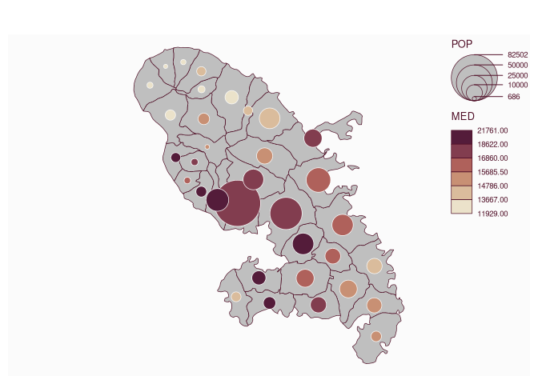

``` r
# type = "prop_typo"
mf_map(mtq)
mf_map(mtq, var = c("POP", "STATUS"), type = "prop_typo")
```

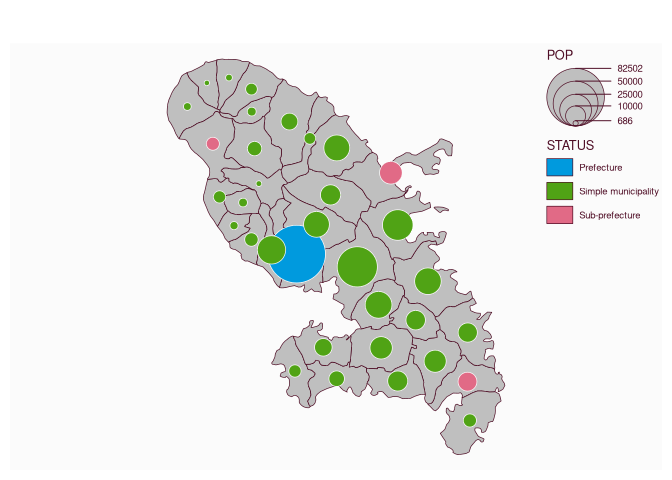

``` r
# type = "symb_choro
mf_map(mtq)
mf_map(mtq, var = c("STATUS", "MED"), type = "symb_choro")
```

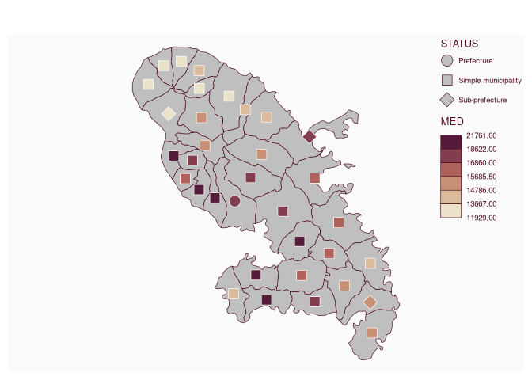

``` r
# detailed examples
# type = "base"
mf_map(mtq, type = "base", col = "lightblue", lwd = 1.5, lty = 2)
```

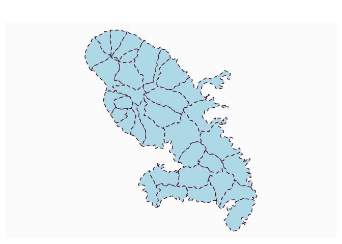

``` r
# type = "prop"
mf_map(mtq)
mf_map(
  x = mtq, var = "POP", type = "prop",
  inches = .4, symbol = "circle", val_max = 90000,
  col = "lightblue", border = "grey", lwd = 1,
  leg_pos = "right", leg_title = "Population",
  leg_title_cex = 1, leg_val_cex = .8, leg_val_rnd = 0,
  leg_frame = TRUE, add = TRUE
)
```

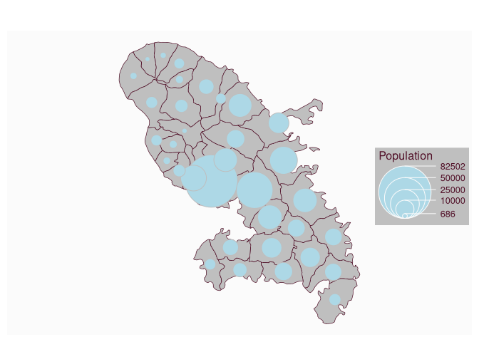

``` r
# type = "choro"
mtq[6, "MED"] <- NA
mf_map(
  x = mtq, var = "MED", type = "choro",
  col_na = "grey80", pal = "Cividis",
  breaks = "quantile", nbreaks = 4, border = "white",
  lwd = .5, leg_pos = "topleft",
  leg_title = "Median Income", leg_title_cex = 1.1,
  leg_val_cex = 1, leg_val_rnd = -2, leg_no_data = "No data",
  leg_frame = TRUE, leg_adj = c(0, -3)
)
```

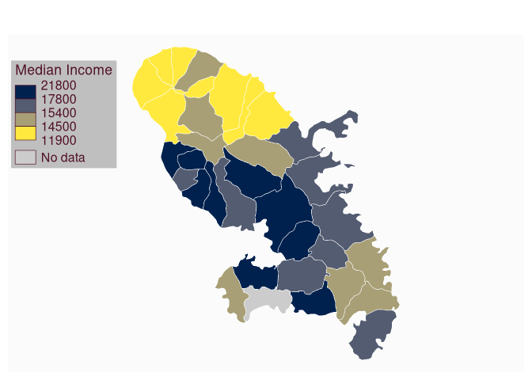

``` r
# type = "typo"
mtq[4, "STATUS"] <- NA
mf_map(
  x = mtq, var = "STATUS", type = "typo",
  pal = c("red", "blue", "yellow"), lwd = 1.1,
  val_order = c("Prefecture", "Sub-prefecture", "Simple municipality"),
  col_na = "green", border = "brown",
  leg_pos = "bottomleft",
  leg_title = "Status", leg_title_cex = 1.1,
  leg_val_cex = 1, leg_no_data = "No data",
  leg_frame = TRUE, add = FALSE
)
```

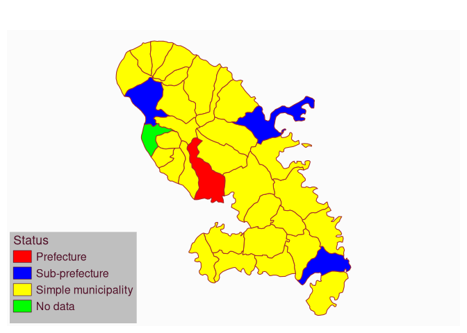

``` r
# type = "symb"
mf_map(mtq)
mf_map(
  x = mtq, var = "STATUS", type = "symb",
  pch = c(21:23), pal = c("red1", "tan1", "khaki1"),
  border = "grey20", cex = c(2, 1.5, 1), lwd = .5,
  val_order = c("Prefecture", "Sub-prefecture", "Simple municipality"),
  pch_na = 24, col_na = "blue", leg_frame = TRUE
)
```

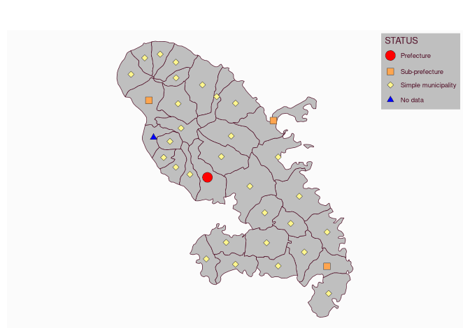

``` r
# type = "grad"
mf_map(mtq)
mf_map(
  x = mtq, var = "POP", type = "grad",
  pch = 22, breaks = "quantile", nbreaks = 4, lwd = 2, border = "blue",
  cex = c(.75, 1.5, 3, 5), col = "lightgreen"
)
```

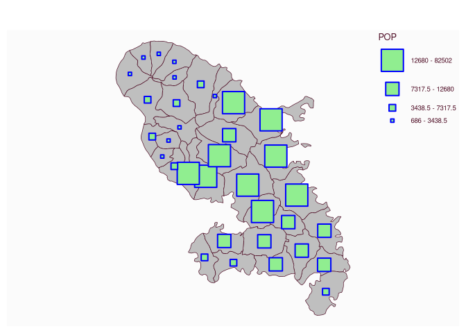

``` r
# type = "prop_choro"
mf_map(mtq)
mf_map(
  x = mtq, var = c("POP", "MED"), type = "prop_choro",
  inches = .35, border = "tomato4",
  val_max = 90000, symbol = "circle", col_na = "white", pal = "Cividis",
  breaks = "equal", nbreaks = 4, lwd = 4,
  leg_pos = "bottomleft",
  leg_title = c("Population", "Median Income"),
  leg_title_cex = c(0.8, 1),
  leg_val_cex = c(.7, .9),
  leg_val_rnd = c(0, 0),
  leg_no_data = "No data",
  leg_frame = c(TRUE, TRUE),
  add = TRUE
)
```

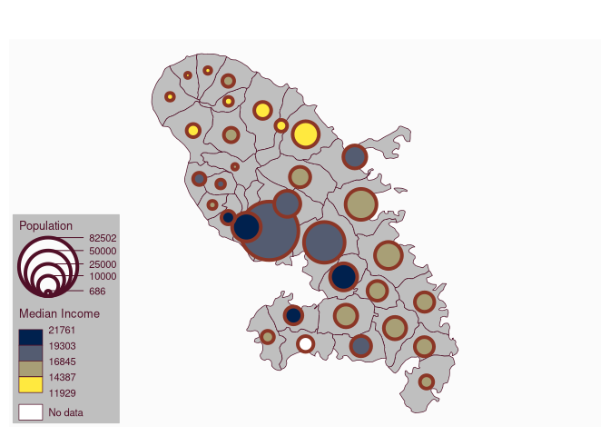

``` r
# type = "prop_typo"
mf_map(mtq)
mf_map(
  x = mtq, var = c("POP", "STATUS"), type = "prop_typo",
  inches = .35, border = "tomato4",
  val_max = 90000, symbol = "circle", col_na = "white", pal = "Dynamic",
  lwd = 2,
  leg_pos = c("bottomright", "bottomleft"),
  leg_title = c("Population", "Municipality\nstatus"),
  leg_title_cex = c(0.9, 0.9),
  leg_val_cex = c(.7, .7),
  val_order = c("Prefecture", "Sub-prefecture", "Simple municipality"),
  leg_no_data = "No dada",
  leg_frame = c(TRUE, TRUE),
  add = TRUE
)
```

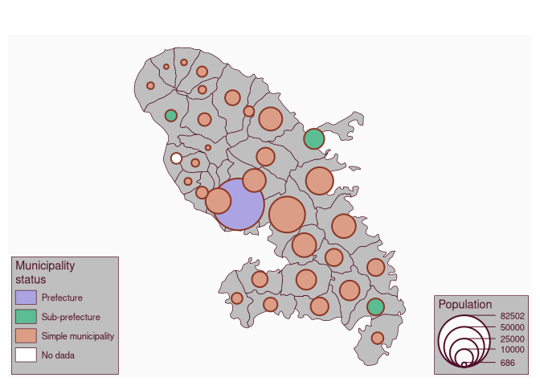

``` r
# type = "symb_choro"
mf_map(mtq)
mf_map(
  x = mtq, c("STATUS", "MED"), type = "symb_choro",
  pal = "Reds 3", breaks = "quantile", nbreaks = 4,
  pch = 21:23, cex = c(3, 2, 1),
  pch_na = 25, cex_na = 1.5, col_na = "blue",
  val_order = c(
    "Prefecture",
    "Sub-prefecture",
    "Simple municipality"
  )
)
```

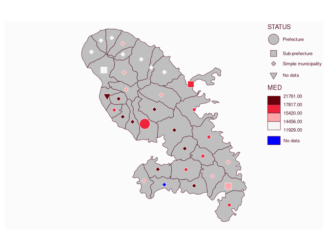
