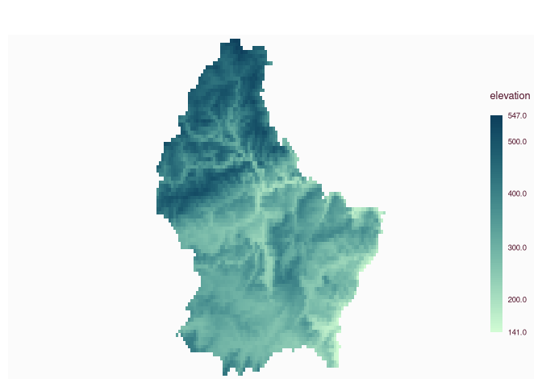
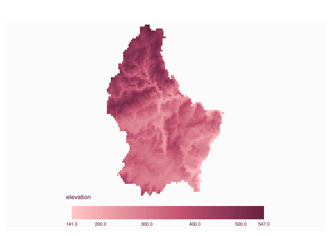
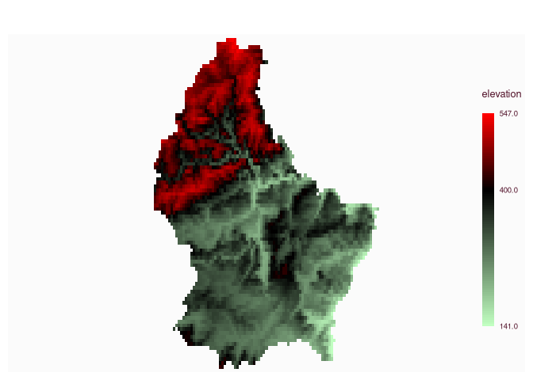
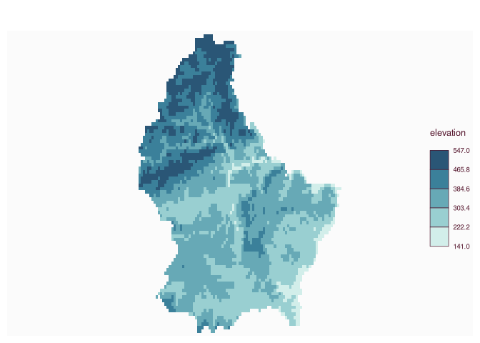
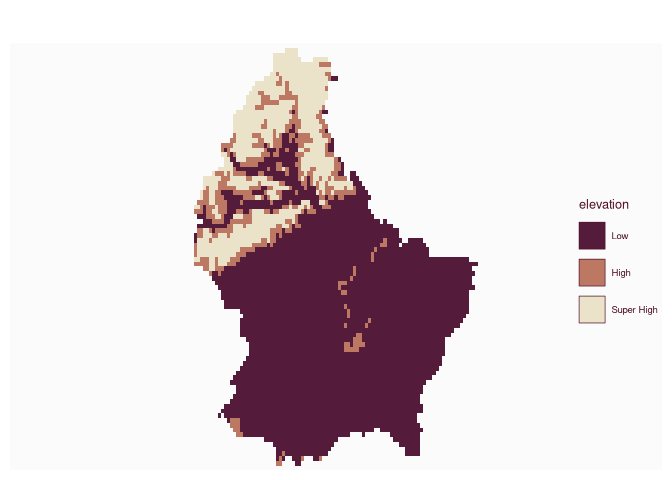
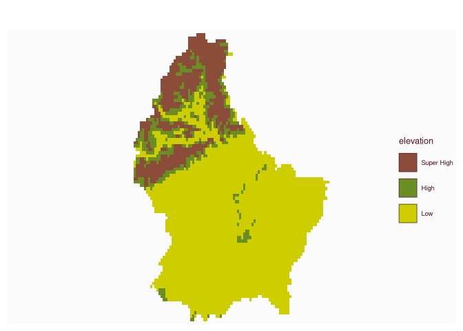

# Plot a raster

[**Source code**](https://github.com/riatelab/mapsf//tree/master/R/mf_raster.R#L80)

## Description

Plot a raster object (SpatRaster from terra).

## Usage

<pre><code class='language-R'>mf_raster(
  x,
  type,
  nbreaks,
  breaks = "equal",
  val_order,
  pal,
  expandBB = rep(0, 4),
  alpha = NULL,
  rev = FALSE,
  leg_pos = "right",
  leg_title = names(x),
  leg_title_cex = 0.8,
  leg_val_cex = 0.6,
  leg_val_rnd = 1,
  leg_frame = FALSE,
  leg_frame_border,
  leg_horiz = FALSE,
  leg_adj = c(0, 0),
  leg_box_border,
  leg_box_cex = c(1, 1),
  leg_fg,
  leg_bg,
  leg_size = 1,
  add = FALSE,
  ...
)
</code></pre>

## Arguments

<table role="presentation">
<tr>
<td style="white-space: nowrap; font-family: monospace; vertical-align: top">
<code id="x">x</code>
</td>
<td>
a SpatRaster
</td>
</tr>
<tr>
<td style="white-space: nowrap; font-family: monospace; vertical-align: top">
<code id="type">type</code>
</td>
<td>
type of raster map, one of "continuous", "classes", or "interval".
Default type for a numeric and categorial raster are "continuous" and
"classes" respectively.
</td>
</tr>
<tr>
<td style="white-space: nowrap; font-family: monospace; vertical-align: top">
<code id="nbreaks">nbreaks</code>
</td>
<td>
number of classes
</td>
</tr>
<tr>
<td style="white-space: nowrap; font-family: monospace; vertical-align: top">
<code id="breaks">breaks</code>
</td>
<td>
either a numeric vector with the actual breaks (for type = "continuous"
and type = "interval"), or a classification method name (for type =
"interval" only; see mf_get_breaks for classification methods)
</td>
</tr>
<tr>
<td style="white-space: nowrap; font-family: monospace; vertical-align: top">
<code id="val_order">val_order</code>
</td>
<td>
values order, a character vector that matches var modalities
</td>
</tr>
<tr>
<td style="white-space: nowrap; font-family: monospace; vertical-align: top">
<code id="pal">pal</code>
</td>
<td>
a set of colors or a palette name (from hcl.colors)
</td>
</tr>
<tr>
<td style="white-space: nowrap; font-family: monospace; vertical-align: top">
<code id="expandBB">expandBB</code>
</td>
<td>
fractional values to expand the bounding box with, in each direction
(bottom, left, top, right)
</td>
</tr>
<tr>
<td style="white-space: nowrap; font-family: monospace; vertical-align: top">
<code id="alpha">alpha</code>
</td>
<td>
opacity, in the range \[0,1\]
</td>
</tr>
<tr>
<td style="white-space: nowrap; font-family: monospace; vertical-align: top">
<code id="rev">rev</code>
</td>
<td>
if <code>pal</code> is a hcl.colors palette name, whether the ordering
of the colors should be reversed (TRUE) or not (FALSE)
</td>
</tr>
<tr>
<td style="white-space: nowrap; font-family: monospace; vertical-align: top">
<code id="leg_pos">leg_pos</code>
</td>
<td>
position of the legend, one of ‘topleft’, ‘top’,‘topright’, ‘right’,
‘bottomright’, ‘bottom’, ‘bottomleft’, ‘left’ or a vector of two
coordinates in map units (c(x, y)). If leg_pos = NA then the legend is
not plotted. If leg_pos = ‘interactive’ click onthe map to choose the
legend position.
</td>
</tr>
<tr>
<td style="white-space: nowrap; font-family: monospace; vertical-align: top">
<code id="leg_title">leg_title</code>
</td>
<td>
legend title
</td>
</tr>
<tr>
<td style="white-space: nowrap; font-family: monospace; vertical-align: top">
<code id="leg_title_cex">leg_title_cex</code>
</td>
<td>
size of the legend title
</td>
</tr>
<tr>
<td style="white-space: nowrap; font-family: monospace; vertical-align: top">
<code id="leg_val_cex">leg_val_cex</code>
</td>
<td>
size of the values in the legend
</td>
</tr>
<tr>
<td style="white-space: nowrap; font-family: monospace; vertical-align: top">
<code id="leg_val_rnd">leg_val_rnd</code>
</td>
<td>
number of decimal places of the values in the legend
</td>
</tr>
<tr>
<td style="white-space: nowrap; font-family: monospace; vertical-align: top">
<code id="leg_frame">leg_frame</code>
</td>
<td>
whether to add a frame to the legend (TRUE) or not (FALSE)
</td>
</tr>
<tr>
<td style="white-space: nowrap; font-family: monospace; vertical-align: top">
<code id="leg_frame_border">leg_frame_border</code>
</td>
<td>
border color of the legend frame
</td>
</tr>
<tr>
<td style="white-space: nowrap; font-family: monospace; vertical-align: top">
<code id="leg_horiz">leg_horiz</code>
</td>
<td>
display the legend horizontally
</td>
</tr>
<tr>
<td style="white-space: nowrap; font-family: monospace; vertical-align: top">
<code id="leg_adj">leg_adj</code>
</td>
<td>
adjust the postion of the legend in x and y directions
</td>
</tr>
<tr>
<td style="white-space: nowrap; font-family: monospace; vertical-align: top">
<code id="leg_box_border">leg_box_border</code>
</td>
<td>
border color of legend boxes
</td>
</tr>
<tr>
<td style="white-space: nowrap; font-family: monospace; vertical-align: top">
<code id="leg_box_cex">leg_box_cex</code>
</td>
<td>
width and height size expansion of boxes
</td>
</tr>
<tr>
<td style="white-space: nowrap; font-family: monospace; vertical-align: top">
<code id="leg_fg">leg_fg</code>
</td>
<td>
color of the legend foreground
</td>
</tr>
<tr>
<td style="white-space: nowrap; font-family: monospace; vertical-align: top">
<code id="leg_bg">leg_bg</code>
</td>
<td>
color of the legend backgournd
</td>
</tr>
<tr>
<td style="white-space: nowrap; font-family: monospace; vertical-align: top">
<code id="leg_size">leg_size</code>
</td>
<td>
size of the legend; 2 means two times bigger
</td>
</tr>
<tr>
<td style="white-space: nowrap; font-family: monospace; vertical-align: top">
<code id="add">add</code>
</td>
<td>
whether to add the layer to an existing plot (TRUE) or not (FALSE)
</td>
</tr>
<tr>
<td style="white-space: nowrap; font-family: monospace; vertical-align: top">
<code id="...">…</code>
</td>
<td>
bgalpha, smooth, maxcell or other arguments passed to be passed to
<code>plotRGB</code> or <code>plot</code>
</td>
</tr>
</table>

## Value

x is (invisibly) returned.

## Examples

``` r
library("mapsf")

if (require("terra")) {
  # multi band
  logo <- rast(system.file("ex/logo.tif", package = "terra"))
  mf_raster(logo)

  # one band
  elev <- rast(system.file("ex/elev.tif", package = "terra"))

  ## continuous
  mf_raster(elev)
  mf_raster(elev,
    pal = "Burg", expandBB = c(.2, 0, 0, 0),
    leg_pos = "bottom", leg_horiz = TRUE
  )

  ## continuous with colors and breaks
  mf_raster(elev,
    type = "continuous",
    breaks = c(141, 400, 547),
    pal = c("darkseagreen1", "black", "red")
  )

  ## interval
  mf_raster(elev,
    type = "interval",
    nbreaks = 5, breaks = "equal", pal = "Teal"
  )

  ## classes
  elev2 <- classify(elev, c(140, 400, 450, 549))
  lev_evel <- data.frame(ID = 0:2, elevation = c("Low", "High", "Super High"))
  levels(elev2) <- lev_evel
  mf_raster(elev2)
  mf_raster(elev2,
    pal = c("salmon4", "olivedrab", "yellow3"),
    val_order = c("Super High", "High", "Low")
  )
}
```













