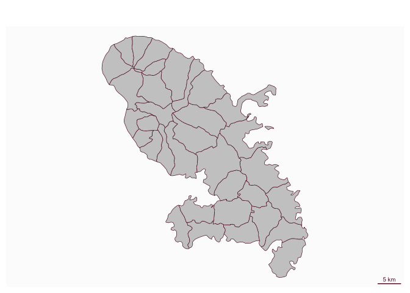
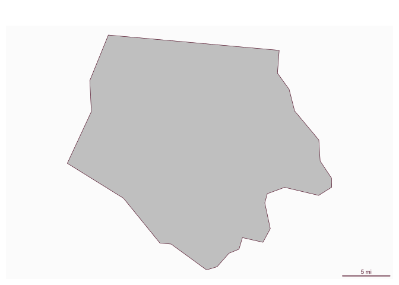
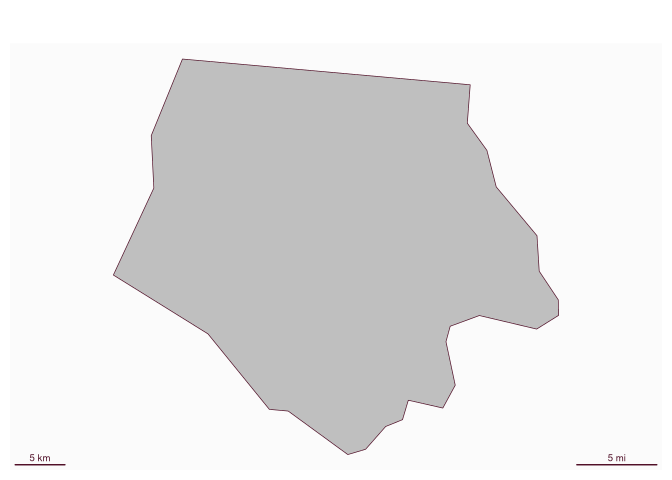

# Plot a scale bar

[**Source code**](https://github.com/riatelab/mapsf//tree/master/R/mf_scale.R#L47)

## Description

Plot a scale bar.

## Usage

<pre><code class='language-R'>mf_scale(
  size,
  pos = "bottomright",
  lwd = 1.5,
  cex = 0.6,
  col,
  crs_units = "m",
  scale_units = "km",
  adj = c(0, 0),
  x
)
</code></pre>

## Arguments

<table role="presentation">
<tr>
<td style="white-space: nowrap; font-family: monospace; vertical-align: top">
<code id="size">size</code>
</td>
<td>
size of the scale bar in scale units (<code>scale_units</code>, default
to km). If size is not set, an automatic size is used.
</td>
</tr>
<tr>
<td style="white-space: nowrap; font-family: monospace; vertical-align: top">
<code id="pos">pos</code>
</td>
<td>
position. It can be one of ‘bottomright’, ‘bottomleft’, ‘interactive’ or
a vector of two coordinates in map units (c(x, y)).
</td>
</tr>
<tr>
<td style="white-space: nowrap; font-family: monospace; vertical-align: top">
<code id="lwd">lwd</code>
</td>
<td>
line width of the scale bar
</td>
</tr>
<tr>
<td style="white-space: nowrap; font-family: monospace; vertical-align: top">
<code id="cex">cex</code>
</td>
<td>
size of the scale bar text
</td>
</tr>
<tr>
<td style="white-space: nowrap; font-family: monospace; vertical-align: top">
<code id="col">col</code>
</td>
<td>
color of the scale bar (line and text)
</td>
</tr>
<tr>
<td style="white-space: nowrap; font-family: monospace; vertical-align: top">
<code id="crs_units">crs_units</code>
</td>
<td>
units used in the CRS of the currently plotted layer. Possible values
are "m" and "ft" (see Details).
</td>
</tr>
<tr>
<td style="white-space: nowrap; font-family: monospace; vertical-align: top">
<code id="scale_units">scale_units</code>
</td>
<td>
units used for the scale bar. Can be "mi" for miles, "ft" for feet, "m"
for meters, or "km" for kilometers (default).
</td>
</tr>
<tr>
<td style="white-space: nowrap; font-family: monospace; vertical-align: top">
<code id="adj">adj</code>
</td>
<td>
adjust the postion of the scale bar in x and y directions
</td>
</tr>
<tr>
<td style="white-space: nowrap; font-family: monospace; vertical-align: top">
<code id="x">x</code>
</td>
<td>
object of class crs, sf or sfc. If set, the CRS of x will be used
instead of <code>crs_units</code> to define CRS units.
</td>
</tr>
</table>

## Details

Most CRS use the meter as unit. Some US CRS use feet or US survey feet.
If unsure of the unit used in the CRS you can use the x argument of the
function. Alternatively, you can use <code>sf::st_crs(zz, parameters =
TRUE)$units_gdal</code> to see which units are used in the
<code>zz</code> layer.

This scale bar does not work on unprojected (long/lat) maps.

## Value

No return value, a scale bar is displayed.

## Examples

``` r
library("mapsf")

mtq <- mf_get_mtq()
mf_map(mtq)
mf_scale()
```



``` r
library(sf)
nc <- st_read(system.file("shape/nc.shp", package = "sf"))[1, ]
```

    Reading layer `nc' from data source `/home/tim/Documents/R/4.5/sf/shape/nc.shp' using driver `ESRI Shapefile'
    Simple feature collection with 100 features and 14 fields
    Geometry type: MULTIPOLYGON
    Dimension:     XY
    Bounding box:  xmin: -84.32385 ymin: 33.88199 xmax: -75.45698 ymax: 36.58965
    Geodetic CRS:  NAD27

``` r
nc_foot <- st_transform(nc, 2264) # NC state plane, US foot
mf_map(nc_foot)
mf_scale(size = 5, crs_units = "ft", scale_units = "mi")
```


``` r
mf_map(nc_foot)
mf_scale(size = 5, x = nc_foot, scale_units = "mi")
```



``` r
nc_meter <- st_transform(nc, 32119) # NC state plane, m
mf_map(nc_meter)
mf_scale(size = 5, crs_units = "m", scale_units = "mi")
mf_scale(size = 5, crs_units = "m", scale_units = "km", pos = "bottomleft")
```


