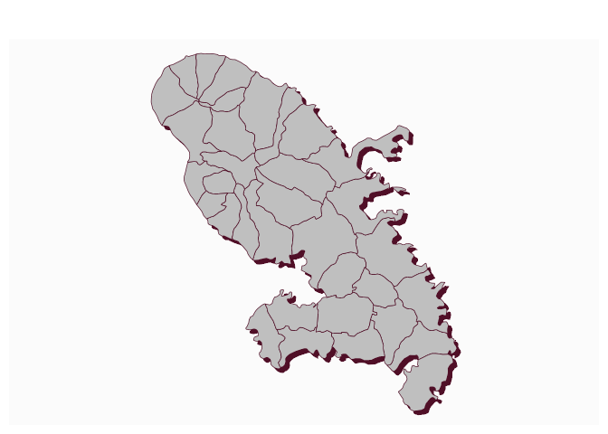

# Plot a shadow

[**Source code**](https://github.com/riatelab/mapsf//tree/master/R/mf_shadow.R#L15)

## Description

Plot the shadow of a polygon layer.

## Usage

<pre><code class='language-R'>mf_shadow(x, col, cex = 1, add = FALSE)
</code></pre>

## Arguments

<table role="presentation">
<tr>
<td style="white-space: nowrap; font-family: monospace; vertical-align: top">
<code id="x">x</code>
</td>
<td>
an sf or sfc polygon object
</td>
</tr>
<tr>
<td style="white-space: nowrap; font-family: monospace; vertical-align: top">
<code id="col">col</code>
</td>
<td>
shadow color
</td>
</tr>
<tr>
<td style="white-space: nowrap; font-family: monospace; vertical-align: top">
<code id="cex">cex</code>
</td>
<td>
shadow extent
</td>
</tr>
<tr>
<td style="white-space: nowrap; font-family: monospace; vertical-align: top">
<code id="add">add</code>
</td>
<td>
whether to add the layer to an existing plot (TRUE) or not (FALSE)
</td>
</tr>
</table>

## Value

x is (invisibly) returned.

## Examples

``` r
library("mapsf")

mtq <- mf_get_mtq()
mf_shadow(mtq)
mf_map(mtq, add = TRUE)
```


