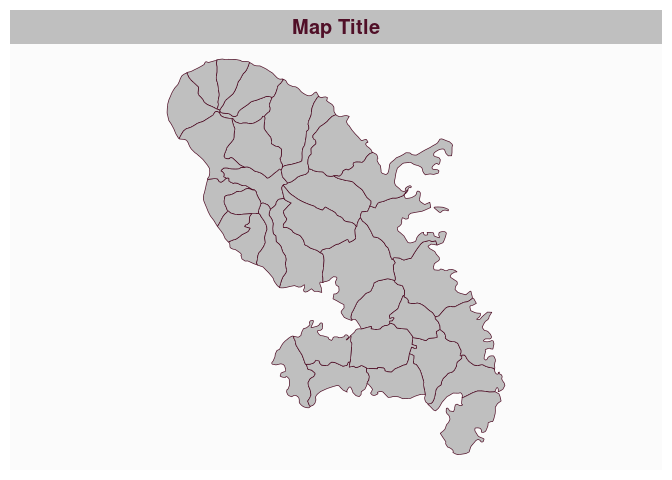
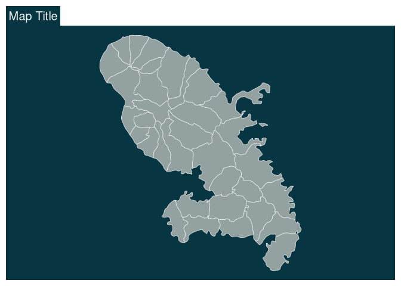
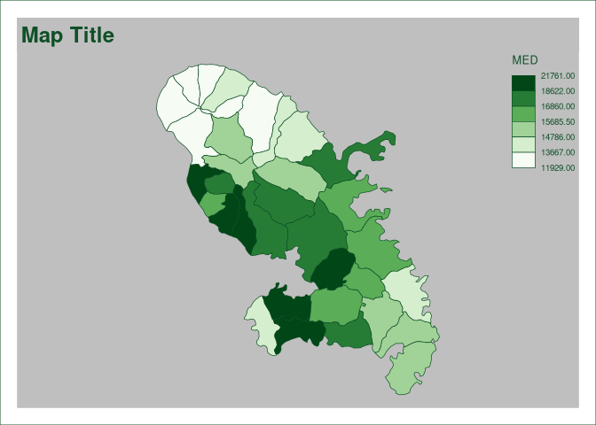

# Set a theme

[**Source code**](https://github.com/riatelab/mapsf//tree/master/R/mf_theme.R#L94)

## Description

A theme is a set of graphical parameters that are applied to maps
created with <code>mapsf</code>. These parameters are:

<ul>
<li>

figure margins and frames,

</li>
<li>

background, foreground and highlight colors,

</li>
<li>

default sequential and qualitative palettes,

</li>
<li>

title options (position, size, banner…).

</li>
</ul>

<code>mapsf</code> offers some builtin themes. It’s possible to modify
an existing theme or to start a theme from scratch. It is also possible
to set a custom theme using a list of arguments

Themes are persistent across maps produced by <code>mapsf</code>
(e.g. they survive a <code>dev.off()</code> call).

Use <code>mf_theme(NULL)</code> or <code>mf_theme(‘base’)</code> to
reset to default theme settings.

## Usage

<pre><code class='language-R'>mf_theme(
  x,
  mar,
  foreground,
  background,
  highlight,
  title_tab,
  title_pos,
  title_inner,
  title_line,
  title_cex,
  title_font,
  title_banner,
  frame,
  frame_lwd,
  frame_lty,
  pal_quali,
  pal_seq,
  ...
)
</code></pre>

## Arguments

<table role="presentation">
<tr>
<td style="white-space: nowrap; font-family: monospace; vertical-align: top">
<code id="x">x</code>
</td>
<td>
name of a map theme. One of "base", "sol_dark", "sol_light", "grey",
"mint", "dracula", "pistachio", "rzine".
</td>
</tr>
<tr>
<td style="white-space: nowrap; font-family: monospace; vertical-align: top">
<code id="mar">mar</code>
</td>
<td>
margins
</td>
</tr>
<tr>
<td style="white-space: nowrap; font-family: monospace; vertical-align: top">
<code id="foreground">foreground</code>
</td>
<td>
foreground color
</td>
</tr>
<tr>
<td style="white-space: nowrap; font-family: monospace; vertical-align: top">
<code id="background">background</code>
</td>
<td>
background color
</td>
</tr>
<tr>
<td style="white-space: nowrap; font-family: monospace; vertical-align: top">
<code id="highlight">highlight</code>
</td>
<td>
highlight color
</td>
</tr>
<tr>
<td style="white-space: nowrap; font-family: monospace; vertical-align: top">
<code id="title_tab">title_tab</code>
</td>
<td>
if TRUE the title is displayed as a ‘tab’
</td>
</tr>
<tr>
<td style="white-space: nowrap; font-family: monospace; vertical-align: top">
<code id="title_pos">title_pos</code>
</td>
<td>
title position, one of ‘left’, ‘center’, ‘right’
</td>
</tr>
<tr>
<td style="white-space: nowrap; font-family: monospace; vertical-align: top">
<code id="title_inner">title_inner</code>
</td>
<td>
if TRUE the title is displayed inside the plot area.
</td>
</tr>
<tr>
<td style="white-space: nowrap; font-family: monospace; vertical-align: top">
<code id="title_line">title_line</code>
</td>
<td>
number of lines used for the title
</td>
</tr>
<tr>
<td style="white-space: nowrap; font-family: monospace; vertical-align: top">
<code id="title_cex">title_cex</code>
</td>
<td>
cex of the title
</td>
</tr>
<tr>
<td style="white-space: nowrap; font-family: monospace; vertical-align: top">
<code id="title_font">title_font</code>
</td>
<td>
font of the title
</td>
</tr>
<tr>
<td style="white-space: nowrap; font-family: monospace; vertical-align: top">
<code id="title_banner">title_banner</code>
</td>
<td>
if TRUE the title is displayed as a banner
</td>
</tr>
<tr>
<td style="white-space: nowrap; font-family: monospace; vertical-align: top">
<code id="frame">frame</code>
</td>
<td>
either "none", "map" or "figure"; plot a frame around the map or the
figure.
</td>
</tr>
<tr>
<td style="white-space: nowrap; font-family: monospace; vertical-align: top">
<code id="frame_lwd">frame_lwd</code>
</td>
<td>
line width for the frame
</td>
</tr>
<tr>
<td style="white-space: nowrap; font-family: monospace; vertical-align: top">
<code id="frame_lty">frame_lty</code>
</td>
<td>
line type for the frame
</td>
</tr>
<tr>
<td style="white-space: nowrap; font-family: monospace; vertical-align: top">
<code id="pal_quali">pal_quali</code>
</td>
<td>
default qualitative color palette (name or function)
</td>
</tr>
<tr>
<td style="white-space: nowrap; font-family: monospace; vertical-align: top">
<code id="pal_seq">pal_seq</code>
</td>
<td>
default sequential color palettte (name or function)
</td>
</tr>
<tr>
<td style="white-space: nowrap; font-family: monospace; vertical-align: top">
<code id="...">…</code>
</td>
<td>
other argument, ignored
</td>
</tr>
</table>

## Value

The current list of theme parameters is (invisibly) returned.

## Note

Although the map theming system has been radically changed in version
1.0.0 of the package, you can still use the old themes by referencing
them by name.

## Examples

``` r
library("mapsf")

mtq <- mf_get_mtq()

# Choosing a theme by name:
mf_theme("base")
mf_map(mtq)
mf_title()
```


``` r
# Specifying some values directly:
mf_theme(title_banner = TRUE)
mf_map(mtq)
mf_title()
```



``` r
# Using a mix of the above:
mf_theme("sol_dark", title_tab = TRUE, title_font = 1)
mf_map(mtq)
mf_title()
```



``` r
# Specifying a list with theme values:
theme <- list(
  mar = c(1, 1, 3, 1),
  title_tab = FALSE,
  title_pos = "left",
  title_inner = FALSE,
  title_line = 2,
  title_cex = 1.5,
  title_font = 2,
  title_banner = FALSE,
  frame = "figure",
  frame_lwd = 1,
  frame_lty = 1,
  foreground = "#fbfbfb",
  background = "grey75",
  highlight = "#0f5027",
  pal_quali = "Dark 3",
  pal_seq = "Greens"
)
mf_theme(theme)
mf_map(mtq, "MED", "choro")
mf_title()
```



``` r
# Obtaining a list of parameters for the current theme:
current_theme <- mf_theme()

# Use default theme:
mf_theme(NULL)
# or
mf_theme("base")
```
