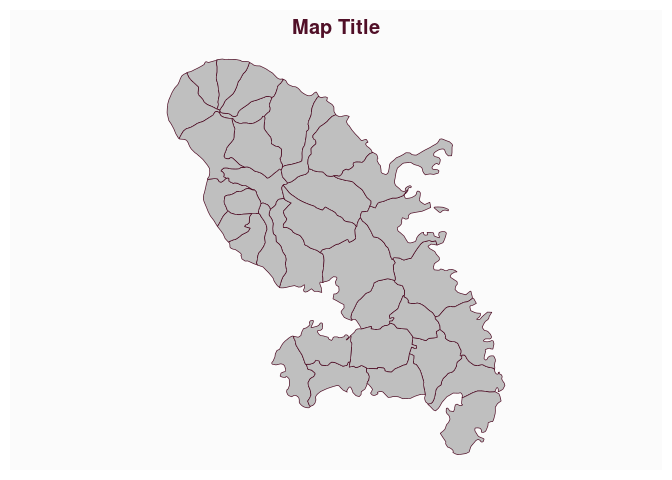

# Plot a title

[**Source code**](https://github.com/riatelab/mapsf//tree/master/R/mf_title.R#L19)

## Description

Plot a title

## Usage

<pre><code class='language-R'>mf_title(txt = "Map Title", pos, tab, bg, fg, cex, line, font, inner, banner)
</code></pre>

## Arguments

<table role="presentation">
<tr>
<td style="white-space: nowrap; font-family: monospace; vertical-align: top">
<code id="txt">txt</code>
</td>
<td>
title text
</td>
</tr>
<tr>
<td style="white-space: nowrap; font-family: monospace; vertical-align: top">
<code id="pos">pos</code>
</td>
<td>
position, one of ‘left’, ‘center’, ‘right’
</td>
</tr>
<tr>
<td style="white-space: nowrap; font-family: monospace; vertical-align: top">
<code id="tab">tab</code>
</td>
<td>
if TRUE the title is displayed as a tab
</td>
</tr>
<tr>
<td style="white-space: nowrap; font-family: monospace; vertical-align: top">
<code id="bg">bg</code>
</td>
<td>
background of the title
</td>
</tr>
<tr>
<td style="white-space: nowrap; font-family: monospace; vertical-align: top">
<code id="fg">fg</code>
</td>
<td>
foreground of the title
</td>
</tr>
<tr>
<td style="white-space: nowrap; font-family: monospace; vertical-align: top">
<code id="cex">cex</code>
</td>
<td>
cex of the title
</td>
</tr>
<tr>
<td style="white-space: nowrap; font-family: monospace; vertical-align: top">
<code id="line">line</code>
</td>
<td>
number of lines used for the title
</td>
</tr>
<tr>
<td style="white-space: nowrap; font-family: monospace; vertical-align: top">
<code id="font">font</code>
</td>
<td>
font of the title
</td>
</tr>
<tr>
<td style="white-space: nowrap; font-family: monospace; vertical-align: top">
<code id="inner">inner</code>
</td>
<td>
if TRUE the title is displayed inside the plot area
</td>
</tr>
<tr>
<td style="white-space: nowrap; font-family: monospace; vertical-align: top">
<code id="banner">banner</code>
</td>
<td>
if TRUE the title is dispalayed as a banner
</td>
</tr>
</table>

## Value

No return value, a title is displayed.

## Examples

``` r
library("mapsf")

mtq <- mf_get_mtq()
mf_map(mtq)
mf_title()
```


