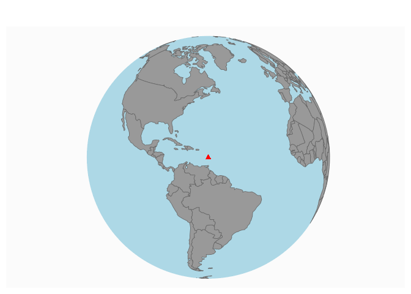
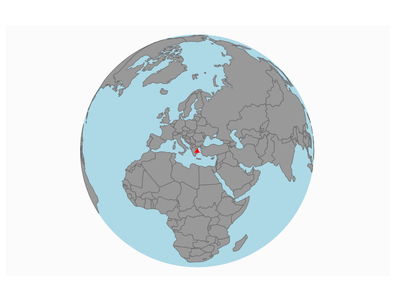
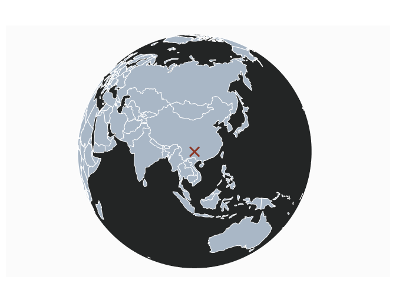

# Plot a point on a world map

[**Source code**](https://github.com/riatelab/mapsf//tree/master/R/mf_worldmap.R#L26)

## Description

Plot a point on a world map.

## Usage

<pre><code class='language-R'>mf_worldmap(
  x,
  lon,
  lat,
  water_col = "lightblue",
  land_col = "grey60",
  border_col = "grey40",
  border_lwd = 0.8,
  ...
)
</code></pre>

## Arguments

<table role="presentation">
<tr>
<td style="white-space: nowrap; font-family: monospace; vertical-align: top">
<code id="x">x</code>
</td>
<td>
object of class <code>sf</code> or <code>sfc</code>
</td>
</tr>
<tr>
<td style="white-space: nowrap; font-family: monospace; vertical-align: top">
<code id="lon">lon</code>
</td>
<td>
longitude
</td>
</tr>
<tr>
<td style="white-space: nowrap; font-family: monospace; vertical-align: top">
<code id="lat">lat</code>
</td>
<td>
latitude
</td>
</tr>
<tr>
<td style="white-space: nowrap; font-family: monospace; vertical-align: top">
<code id="water_col">water_col</code>
</td>
<td>
color of the water
</td>
</tr>
<tr>
<td style="white-space: nowrap; font-family: monospace; vertical-align: top">
<code id="land_col">land_col</code>
</td>
<td>
color of the land
</td>
</tr>
<tr>
<td style="white-space: nowrap; font-family: monospace; vertical-align: top">
<code id="border_col">border_col</code>
</td>
<td>
color of the borders
</td>
</tr>
<tr>
<td style="white-space: nowrap; font-family: monospace; vertical-align: top">
<code id="border_lwd">border_lwd</code>
</td>
<td>
width of the borders
</td>
</tr>
<tr>
<td style="white-space: nowrap; font-family: monospace; vertical-align: top">
<code id="...">…</code>
</td>
<td>
further parameters related to the plotted point aspect (cex, pch, col…)
</td>
</tr>
</table>

## Value

No return value, a world map is displayed.

## Note

The main part of the code is stolen from @fzenoni
(<a href="https://gist.github.com/fzenoni/ef23faf6d1ada5e4a91c9ef23b0ba2c1">https://gist.github.com/fzenoni/ef23faf6d1ada5e4a91c9ef23b0ba2c1</a>).

## Examples

``` r
library("mapsf")

mtq <- mf_get_mtq()
mf_worldmap(mtq)
```



``` r
mf_worldmap(lon = 24, lat = 39)
```



``` r
mf_worldmap(
  lon = 106, lat = 26,
  pch = 4, lwd = 3, cex = 2, col = "tomato4",
  water_col = "#232525", land_col = "#A9B7C6",
  border_col = "white", border_lwd = 1
)
```


