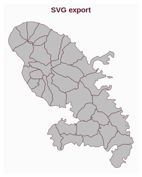
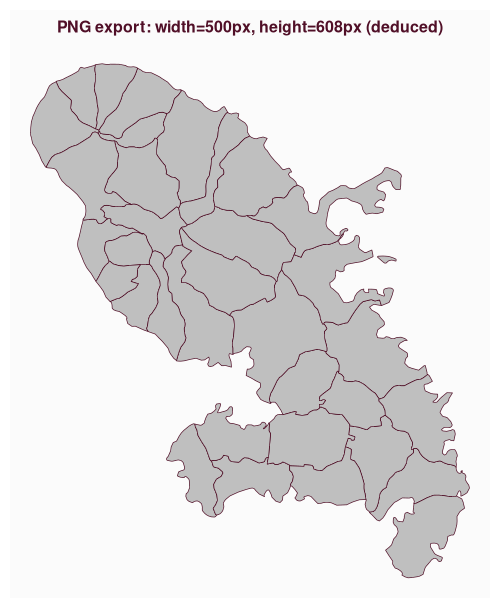
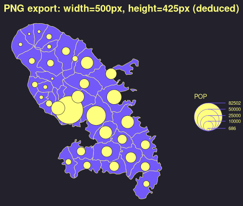

# How to Export Maps
Timothée Giraud
2025-06-20

**`mf_svg()`** and **`mf_png()`** export maps in SVG and PNG formats,
respectively.

**SVG export** is the perfect solution for editing maps with desktop
vector graphics software, such as Inkscape. SVG is a [vector
graphics](https://en.wikipedia.org/wiki/Vector_graphics) file format.  
**PNG export** should be used for maps that do not require further
modification. PNG is a [raster
graphics](https://en.wikipedia.org/wiki/Raster_graphics) file format.

The width/height ratio of the exported map matches that of a spatial
object. If `width` is specified, then `height` is deduced from the
width/height ratio of `x`. Alternatively, if `height` is specified, then
`width` is deduced from the width/height ratio of `x`.  
This helps to produce maps without too much wasted space.

## SVG Export

The SVG format is perfect for producing maps that need further editing
or resizing.

``` r
library(mapsf)
mtq <- mf_get_mtq()
mf_svg(
  x = mtq,
  filename = "fig/wo_export_fixed_height.svg",
  height = 5,
)
mf_map(mtq)
mf_title(txt = "SVG export")
dev.off()
```



The default driver for building SVG files, `grDevices::svg()`, has
limitations regarding speed, file size, editability, and font support.
The [`svglite`](https://svglite.r-lib.org/) package aims to solve these
issues. The `svglite` package is not lightweight in terms of
dependencies, so it is not imported by `mapsf`, but rather suggested.
However, we strongly recommend its use if the aim is to edit the maps
after export.

## PNG Export

In this example we only set the `width` of the exported figure.

``` r
mf_png(
  x = mtq,
  filename = "fig/wo_export_fixed_width.png",
  width = 500
)
mf_map(mtq)
mf_title(txt = "PNG export: width=500px, height=608px (deduced)", cex = 1)
dev.off()
```



In the following example, we used the “dracula” theme and we added space
to the right of the plot (50% of `x` width) in order to get some extra
space for the legend.

``` r
mf_theme("dracula")
mf_png(
  x = mtq,
  filename = "fig/wo_export_fixed_width_expand.png",
  width = 500,
  expandBB = c(0, 0, 0, .5)
)
mf_map(mtq, expandBB = c(0, 0, 0, .5))
mf_map(mtq, "POP", "prop", leg_pos = "right")
mf_title(txt = "PNG export: width=500px, height=425px (deduced)")
dev.off()
```


