```{r, include = FALSE}
knitr::opts_chunk$set(
  collapse = TRUE,
  comment = "#>",
  fig.width = 4,
  fig.height = 4,
  fig.path = "fig/wo_theme_"
)
```


**`mf_theme()`** sets a map theme. A theme is a set of graphical parameters that are applied to maps created with `mapsf`.   
These parameters are:

- figure margins and frames, 
- background, foreground and highlight colors, 
- default sequential and qualitative palettes,
- title options (position, size, banner...).

`mapsf` offers some builtin themes. It's possible to modify an existing theme or to start a theme from scratch.
Themes are persistent across maps produced by `mapsf` (e.g. they survive a `dev.off()` call). 

## Builtin themes

Here are the builtin themes.   

```{r all, echo = FALSE, fig.width=3, fig.height=3.25, results='asis'}
suppressPackageStartupMessages(library(mapsf))
themes <- list(
  "base" = "base",
  "sol_dark" = "sol_dark",
  "sol_light" = "sol_light",
  "grey" = "grey",
  "mint" = "mint",
  "dracula" = "dracula", 
  "rzine" = "rzine", 
  "pistachio" = "pistachio"
)
mtq <- mf_get_mtq()
for (i in 1:length(themes)) {
  mf_theme(themes[[i]])
  mf_export(mtq, width=3*96, filename = paste0( "fig/wo_theme_", names(themes)[[i]], "1.png"))
  mf_map(mtq, add = T)
  mf_map(mtq, "POP", "prop", inches = .15, leg_pos = "topright")
  mf_title(paste0("Theme: ", names(themes)[[i]]))
  mf_credits()
  dev.off()
  mf_export(mtq, width=3*96, filename = paste0( "fig/wo_theme_", names(themes)[[i]], "2.png"))
  mf_theme(themes[[i]])
  mf_map(mtq, "MED", "choro", leg_pos = NA)
  mf_arrow(pos = "topright")
  mf_scale(pos = "bottomleft")
  mf_title("")
  dev.off()

}
```
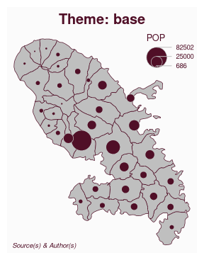 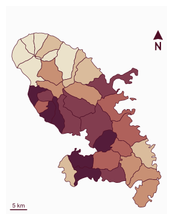
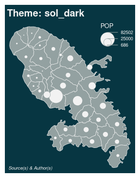 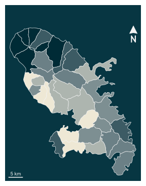
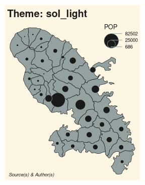 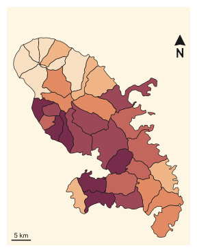
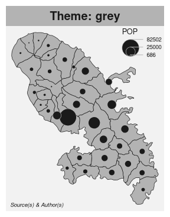 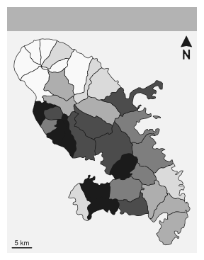
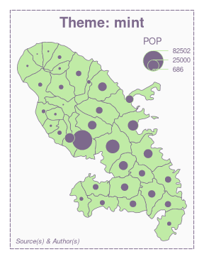 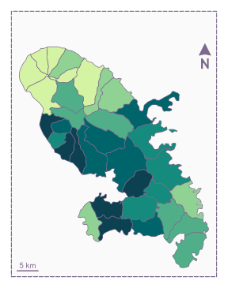
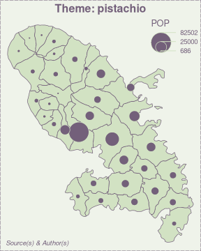 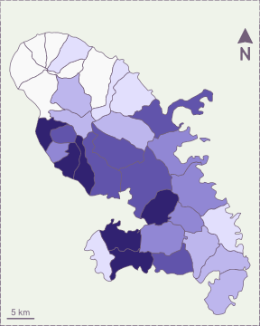
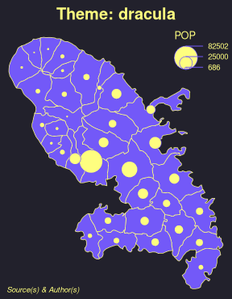 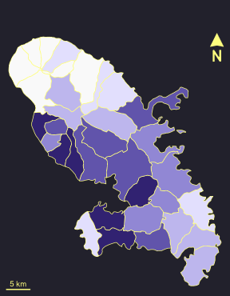
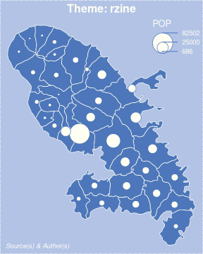 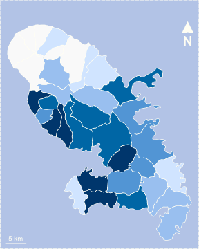


## How to modify an existing theme

It is possible to modify an existing theme. In this example we use the "base" theme and modify some title parameters. 

```{r modified}
library(mapsf)
mtq <- mf_get_mtq()
mf_theme("base", title_banner = FALSE, title_font = 4)
mf_map(mtq)
mf_title('Mofified "default" theme')
```

## How to create a new theme

It is possible to create a new theme from scratch. 

```{r from_scratch}
mf_theme(
  mar          = c(0.1, 0.1, 1.85, 0.1),
  title_tab    = FALSE,
  title_pos    = "left",
  title_inner  = FALSE,
  title_line   = 1.75,
  title_cex    = 1.25,
  title_font   = 4,
  title_banner = FALSE,
  foreground   = "#F1F0E9",
  background   = "white",
  highlight    = "#E9762B",
  frame        = "map",
  frame_lwd    = 4,
  pal_quali    = "Dark 3",
  pal_seq      = colorRampPalette(c("#F1F0E9", "#41644A", "#0D4715"))
)
mf_map(mtq, "MED", "choro")
mf_title("New theme")
```


It is also possible to assign a theme to a variable. 


```{r blue_green}
blue_theme <- mf_theme("base", background = "lightblue")
green_theme <- mf_theme("base", background = "lightgreen")
mf_theme(blue_theme)
mf_map(mtq)
mf_title("Blue Theme")
mf_theme(green_theme)
mf_map(mtq)
mf_title("Green Theme")
```
