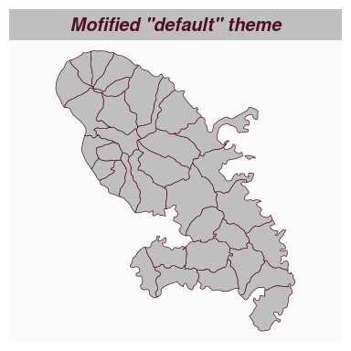
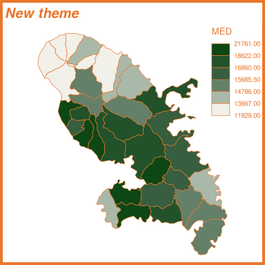
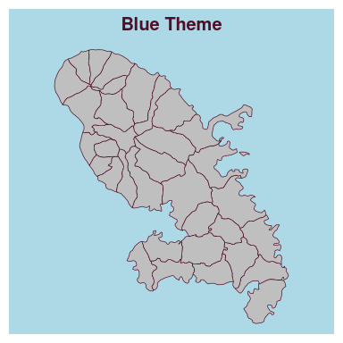
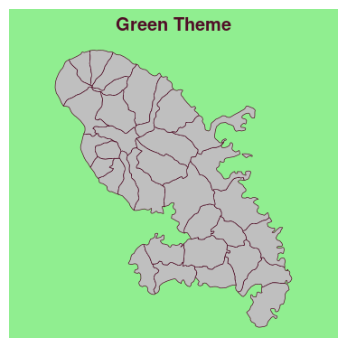
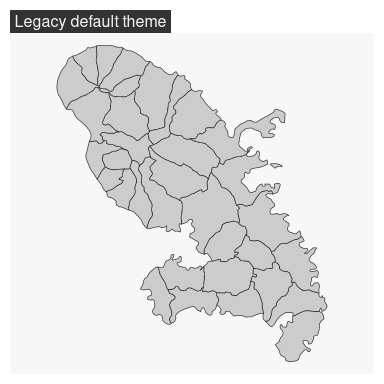

# How to Use Themes
Timothée Giraud
2025-06-20

**`mf_theme()`** sets a map theme. A theme is a set of graphical
parameters that are applied to maps created with `mapsf`.  
These parameters are:

-   figure margins and frames,
-   background, foreground and highlight colors,
-   default sequential and qualitative palettes,
-   title options (position, size, banner…).

`mapsf` offers some builtin themes. It’s possible to modify an existing
theme or to start a theme from scratch. Themes are persistent across
maps produced by `mapsf` (e.g. they survive a `dev.off()` call).

## Builtin themes

Here are the builtin themes.

 
 
 
 
 
 
 
 

## How to modify an existing theme

It is possible to modify an existing theme. In this example we use the
“base” theme and modify some title parameters.

``` r
library(mapsf)
mtq <- mf_get_mtq()
mf_theme("base", title_banner = TRUE, title_font = 4)
mf_map(mtq)
mf_title('Mofified "default" theme')
```



## How to create a new theme

It is possible to create a new theme from scratch.

``` r
mf_theme(
  mar          = c(0.1, 0.1, 1.85, 0.1),
  title_tab    = FALSE,
  title_pos    = "left",
  title_inner  = FALSE,
  title_line   = 1.75,
  title_cex    = 1.25,
  title_font   = 4,
  title_banner = FALSE,
  foreground   = "#F1F0E9",
  background   = "white",
  highlight    = "#E9762B",
  frame        = "map",
  frame_lwd    = 4,
  pal_quali    = "Dark 3",
  pal_seq      = colorRampPalette(c("#F1F0E9", "#41644A", "#0D4715"))
)
mf_map(mtq, "MED", "choro")
mf_title("New theme")
```



It is also possible to assign a theme to a variable.

``` r
blue_theme <- mf_theme("base", background = "lightblue")
green_theme <- mf_theme("base", background = "lightgreen")
mf_theme(blue_theme)
mf_map(mtq)
mf_title("Blue Theme")
```



``` r
mf_theme(green_theme)
mf_map(mtq)
mf_title("Green Theme")
```



## Legacy themes

Although the map theming system has been radically changed in version
1.0.0 of the package, you can still use the old themes by referencing
them by name.

``` r
mf_theme("default")
mf_map(mtq)
mf_title("Legacy default theme")
```


