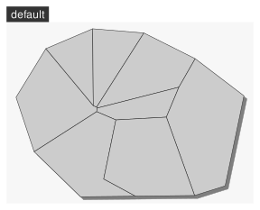

```{r, include = FALSE}
knitr::opts_chunk$set(
  collapse = TRUE,
  comment = "#>", 
  fig.width = 5, 
  fig.height = 6
)
```

# Introduction

The aim of `mapsf` is to obtain thematic maps with the visual quality of those build with a classical mapping or GIS software.

Users of the package could belong to one of two categories: cartographers willing to use R or R users willing to create maps. Therefore, its functions have to be intuitive to cartographers and ensure compatibility with common R workflows.

`mapsf` uses [`sf`](https://CRAN.R-project.org/package=sf) objects to produce `base` graphics.

`mapsf` functions can be classified in the following categories :

-   **Symbology**\
    `mf_map()` displays map layers on a georeferenced plot. It has three main arguments:

    -   `x`, an `sf` object;
    -   `var`, the name(s) of a variable(s) to map;
    -   `type`, the map layer type.

    Many parameters are available to fine tune the cartographic representations. These parameters are the common ones found in GIS and automatic cartography tools (e.g. classification and color palettes used in choropleth maps, symbols sizes used in proportional symbols maps...).

-   **Map Layout**\
    Along with the cartographic functions, some other functions are dedicated to layout design (e.g. legends, scale bar, north arrow, title, credits...).

-   **Utility Functions**\
    A set of functions is dedicated to the creation of spatial objects (e.g. links creation) or other utility tasks (e.g. color palette management, class intervals extraction, sample dataset import...).

# Main Features

## Symbology

The **type** column indicates the value to use for the `type` argument in `mf_map(x, var, type)`. The **data** column displays the relevant data types for each map types. The **cartography** column indicates the corresponding function in `cartography`.

+------------------------------+----------------+------------------+----------------------+-----------------------+---------------------+---------------------------+
| map type                     | type           | data             | polygon              | point                 | line                | cartography               |
+==============================+================+==================+======================+=======================+=====================+===========================+
| Base Map                     | `"base"`       | geometry         |     |     |    | \-                        |
+------------------------------+----------------+------------------+----------------------+-----------------------+---------------------+---------------------------+
| Proportional Symbols         | `"prop"`       | stock            |   |   |  | `propSymbolsLayer()`      |
+------------------------------+----------------+------------------+----------------------+-----------------------+---------------------+---------------------------+
| Typology                     | `"typo"`       | category         |   |   |  | `typoLayer()`             |
+------------------------------+----------------+------------------+----------------------+-----------------------+---------------------+---------------------------+
| Choropleth                   | `"choro"`      | ratio            |   |   |  | `choroLayer()`            |
+------------------------------+----------------+------------------+----------------------+-----------------------+---------------------+---------------------------+
| Graduated Symbols            | `"grad"`       | stock            |   |   |  | \-                        |
+------------------------------+----------------+------------------+----------------------+-----------------------+---------------------+---------------------------+
| Symbols                      | `"symb"`       | category         |   |   |                     | \-                        |
+------------------------------+----------------+------------------+----------------------+-----------------------+---------------------+---------------------------+
| Proportional Symbols + Typo  | `"prop_typo"`  | stock & category |  |  |                     | `propSymbolsTypoLayer()`  |
+------------------------------+----------------+------------------+----------------------+-----------------------+---------------------+---------------------------+
| Proportional Symbols + Choro | `"prop_choro"` | stock & ratio    |  |  |                     | `propSymbolsChoroLayer()` |
+------------------------------+----------------+------------------+----------------------+-----------------------+---------------------+---------------------------+
| Symbols + Choro              | `"symb_choro"` | category & ratio |  |  |                     | \-                        |
+------------------------------+----------------+------------------+----------------------+-----------------------+---------------------+---------------------------+

## Map Layout

|                                |
|:------------------------------:|
| {width="4in"} |

| name              | cartography          |
|-------------------|----------------------|
| `mf_title()`      | \- / `layoutLayer()` |
| `mf_arrow()`      | `north()`            |
| `mf_credits()`    | \- / `layoutLayer()` |
| `mf_scale()`      | `barscale()`         |
| `mf_layout()`     | `layoutLayer()`      |
| `mf_annotation()` | \-                   |
| `mf_label()`      | `labelLayer()`       |

## Themes

`mf_theme()` defines a map theme. It sets the margins of the figure, a background color, a foreground color and some parameters of the title. A set of theme is included in the package and it is possible to create custom ones.

|                                      |                                         |                                      |
|:------------------------------------:|:---------------------------------------:|:------------------------------------:|
| {width="2in"} | {width="2in"} | {width="2in"}  |
|  {width="192"}  |    {width="192"}    | {width="192"} |
|  {width="192"}  |  {width="192"}   |   {width="192"}   |
|   {width="192"}   | {width="192"}  |                                      |

## Export

The `mf_export()` function exports maps in raster (.png) or vector formats (.svg). The size of the exported map will fit the height/width ratio of a spatial object.

## Datasets

Several datasets are embedded in the package:

-   A [GeoPackage](https://www.geopackage.org/) of Martinique municipalities can be imported with `mf_get_mtq()` (or via `sf::st_read()`).

    -   Sources: [Base comparateur de territoires](https://www.insee.fr/fr/statistiques/2521169) (upload date: 2018-09-25) & ADMIN EXPRESS-COG (2018 edition).

    -   Citation: Insee and IGN, 2018

    -   Fields:

        -   **INSEE_COM**: Municipality identifier
        -   **STATUS**: Municipality administrative status
        -   **LIBGEO**: Municipality name
        -   **POP**: Total population, 2015
        -   **MED**: Median disposable income adjusted per equivalent household member, in euros, 2015
        -   **CHOM**: Unemployed population, 2015
        -   **ACT**: Active population, 2015

-   A csv file of professional mobility flows between Martinique municipalities.

    -   Sources: [Flux de mobilité - déplacements domicile-lieu de travail](https://www.insee.fr/fr/statistiques/3566477) (upload date: 2018-08-01)

    -   Citation: Insee, 2018

    -   Fields:

        -   **i**: Municipality of residence identifier
        -   **j**: Municipality of workplace identifier
        -   **fij**: Flows of workers (employed population, 15 y.o. or more, 2015, only flows \> 100)
        -   **sj**: Administrative status of the workplace municipality

# Examples of thematic maps

## Base map

`mf_init()` is designed to initiate a map centered on a specific extent (`x` bbox). The `theme` argument allows to select a theme.

`mf_shadow()` plots the shadow of a polygon layer.

`mf_map(x, type = "base")` displays `sf` objects geometries.

`mf_layout()` add a complete layout to the map (title, credits, north arrow, scale bar). Each layout elements can also be set separately (with `mf_title()`, `mf_credits()`, `mf_arrow()` and `mf_scale()`).

```{r mf_init, message=FALSE, warning=FALSE}
library(mapsf)
# import the sample data set
mtq <- mf_get_mtq()
# Initiate a base map
mf_init(x = mtq, theme = "iceberg")
# Plot a shadow
mf_shadow(mtq, add = TRUE)
# plot municipalities 
mf_map(mtq, type = "base", add = TRUE)
# layout
mf_layout(title = "Martinique", 
          credits = paste0("Sources: IGN, 2018\n", 
                           "mapsf ", 
                           packageVersion("mapsf")))
```

## Proportional Symbols

`mf_map(x, var, type = "prop")` displays symbols with areas proportional to a quantitative variable (stocks). The `inches` argument is used to customize the symbols sizes.

```{r mf_prop, message=FALSE, warning=FALSE}
library(mapsf)
# import the sample data set
mtq <- mf_get_mtq()
# Initiate a base map
mf_init(x = mtq, theme = "iceberg")
# Plot a shadow
mf_shadow(mtq, add = TRUE)
# plot municipalities 
mf_map(mtq, add = TRUE)
# plot population
mf_map(
  x = mtq, 
  var = "POP",
  type = "prop",
  inches = 0.25, 
  col = "brown4",
  leg_pos = "bottomleft2",  
  leg_title = "Total population"
)
# layout
mf_layout(title = "Population Distribution in Martinique", 
          credits = paste0("Sources: Insee and IGN, 2018\n",
                           "mapsf ", 
                           packageVersion("mapsf")))
```

## Choropleth Map

In choropleth maps, areas are shaded according to the variation of a quantitative variable. They are used to represent ratios or indices.\
`mf_map(x, var, type = "choro")` displays choropleth maps . Arguments `nbreaks`, and `breaks` allow to customize the variable classification. `mf_get_breaks()` allows to classify data outside of the function itself. Colors palettes, defined with `pal`, can be created with `mf_get_pal()` or you can use palette names from `hcl.pals()`.

Use `mf_theme()` to set a theme without plotting anything.

```{r mf_map_c}
library(mapsf)
# import the sample data set
mtq <- mf_get_mtq()
# population density (inhab./km2) using sf::st_area()
mtq$POPDENS <- 1e6 * mtq$POP / sf::st_area(mtq)
# set a theme
mf_theme("green")
# plot population density
mf_map(
  x = mtq, 
  var = "POPDENS",
  type = "choro",
  breaks = "geom",
  nbreaks = 5,
  pal = "Greens",
  border = "white", 
  lwd = 0.5,
  leg_pos = "topright", 
  leg_title = "Population Density\n(people per km2)"
) 
# layout
mf_layout(title = "Population Distribution in Martinique", 
          credits = paste0("Sources: Insee and IGN, 2018\n",
                           "mapsf ", 
                           packageVersion("mapsf")))
```

## Typology Map

`mf_map(x, var, type = "typo")` displays a typology map of a qualitative variable. `val_order` is used to set the modalities order in the legend.

`mf_label()` displays labels on the map.

```{r mf_map_t}
library(mapsf)
# import the sample data set
mtq <- mf_get_mtq()
# set theme
mf_theme("dark")
# plot administrative status
mf_map(
  x = mtq, 
  var = "STATUS", 
  type = "typo",
  pal = c("aquamarine4", "yellow3","wheat"), 
  lwd = .5,
  val_order = c("Prefecture",
                "Sub-prefecture", 
                "Simple municipality"),
  leg_pos = "topright",
  leg_title = ""
)
# labels for a few  municipalities
mf_label(x = mtq[mtq$STATUS != "Simple municipality",], var = "LIBGEO", 
         cex = 0.9, halo = TRUE, r = 0.15)
# layout
mf_layout(title = "Administrative Status", 
          credits = paste0("Sources: Insee and IGN, 2018\n",
                           "mapsf ", 
                           packageVersion("mapsf")))
```

## Proportional Symbols using Choropleth Coloration

`mf_map(x, var, type = "prop_choro")` creates a map of symbols that are proportional to values of a first variable and colored to reflect the classification of a second variable.

`expandBB` argument in `mf_init()` allows to expand the map space. Here, we increase the space available on the right of the map to avoid overlaps between the legends and the map.

```{r mf_map_pc, fig.width=5}
library(mapsf)
# import the sample data set
mtq <- mf_get_mtq()
# set theme
mf_init(x = mtq, theme = "candy", expandBB = c(0,0,0,.15))
# Plot a shadow
mf_shadow(mtq, add = TRUE)
# Plot the municipalities
mf_map(mtq, add = TRUE)
# Plot symbols with choropleth coloration
mf_map(
  x = mtq, 
  var = c("POP", "MED"), 
  type = "prop_choro",
  border = "grey50",
  lwd = 1,
  leg_pos = c("topright", "right"), 
  leg_title= c("Population","Median\nIncome\n(in euros)"),
  breaks = "equal", 
  nbreaks = 4, 
  pal = "Greens",
  leg_val_rnd = c(0, -2), 
  leg_frame = c(TRUE, TRUE)
) 
# layout
mf_layout(title = "Population & Wealth in Martinique, 2015", 
          credits = paste0("Sources: Insee and IGN, 2018\n",
                           "mapsf ", 
                           packageVersion("mapsf")), 
          frame = TRUE)

```

## Proportional Symbols using Typology Coloration

`f_map(x, var, type = "prop_typo")` creates a map of symbols that are proportional to values of a first variable and colored to reflect the modalities of a second qualitative variable.

```{r mf_map_pt, fig.width=5}
library(mapsf)
# import the sample data set
mtq <- mf_get_mtq()
# set theme
mf_init(x = mtq, theme = "ink", expandBB = c(0,0,0,.15))
# Plot a shadow
mf_shadow(mtq, add = TRUE)
# Plot the municipalities
mf_map(mtq, add = TRUE)
# Plot symbols with choropleth coloration
mf_map(
  x = mtq, 
  var = c("POP","STATUS"), 
  type = "prop_typo",
  symbol = "square",
  border = "white",
  lwd = .5,
  leg_pos = c("right",  "topright"), 
  leg_title = c("Population", "Administrative\nStatus"),
  val_order = c("Prefecture", "Sub-prefecture", 
                "Simple municipality")) 
# layout
mf_layout(title = "Population Distribution in Martinique", 
          credits = paste0("Sources: Insee and IGN, 2018\n",
                           "mapsf ", 
                           packageVersion("mapsf")))
```

## Label Map

`mf_label()` is dedicated to the display of labels on a map. The `overlap = FALSE` argument displays non overlapping labels.

In this example we have built a custom theme with `mf_theme()`.

```{r mf_label}
library(mapsf)
# import the sample data set
mtq <- mf_get_mtq()
# set theme
my_theme <- list(
  name = "mytheme", 
  bg = "lightblue1", 
  fg = "darkseagreen4", 
  mar = c(0, 0, 0, 0), 
  tab = TRUE, 
  pos = "left", 
  inner = TRUE, 
  line = 1, 
  cex = .9, 
  font = 3
  )
mf_theme(my_theme)
# plot municipalities
mf_map(mtq, col = "#e4e9de", border = "darkseagreen4")
# plot labels
mf_label(
  x = mtq, 
  var = "LIBGEO", 
  col = "black", 
  cex = 0.7, 
  font = 4,
  halo = TRUE, 
  bg = "white", 
  r = 0.1, 
  overlap = FALSE, 
  lines = FALSE
)
# layout
mf_layout(title = "Municipalities of Martinique", 
          credits = paste0("Sources: Insee and IGN, 2018\n",
                           "mapsf ", 
                           packageVersion("mapsf")), 
          arrow = FALSE)
# north arrow
mf_arrow(pos ='topright')
```

## Links Map

`mf_get_links()` creates a link layer from an `sf` object and a link `data.frame` (long format).

`mf_map(x, var, type = "grad")` displays graduated links.

We have used `leg_pos = "bottomleft2"` to display the legend in the bottom left corner of the map with an extra space to avoid overlaps between the legend and the credits.

```{r mf_grad}
library(mapsf)
# import the sample data set
mtq <- mf_get_mtq()
# import the csv file embedded in mapsf
mob <- read.csv(system.file("csv/mob.csv", package="mapsf"))
# Select links from Fort-de-France (97209))
mob_97209 <- mob[mob$i == 97209, ]
# create an sf object of links
mob_links <- mf_get_links(x = mtq, df = mob_97209)
# set figure background color
# set theme
mf_init(x = mtq, theme = "dark")
# Plot a shadow
mf_shadow(mtq, add = TRUE)
# Plot the municipalities
mf_map(mtq, add = TRUE)
# plot graduated links
mf_map(
  x = mob_links, 
  var = "fij", 
  type = "grad",
  breaks = c( 100, 500, 1000, 4679.0),
  lwd = c(1,4,8),
  leg_pos = "bottomleft2",
  leg_title = "Nb. of\nCommuters",
  col = "red4", 
  leg_frame = TRUE
) 
# map layout
mf_layout(title = "Commuting to Fort-de-France", 
          credits = paste0("Sources: Insee and IGN, 2018\n",
                           "mapsf ", 
                           packageVersion("mapsf")), 
          arrow = FALSE)
```

```{r, echo = FALSE}
mf_theme("default")

```
