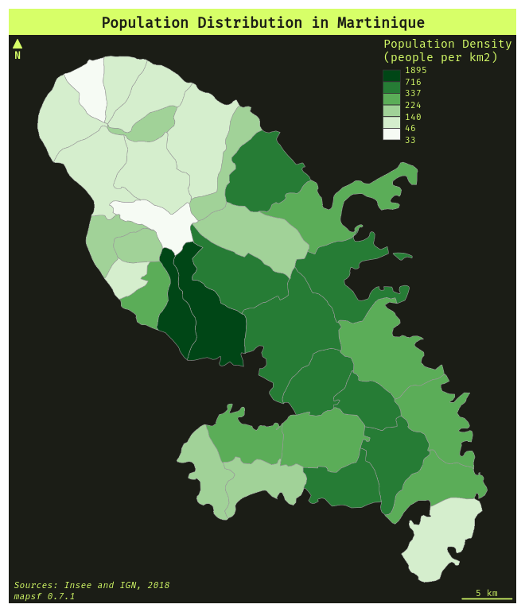

To use a custom font family, the user can use the `family` argument of the `par()` function before plotting the map.
For example, use `par(family = "Fira Mono")` to use the **Fira Mono** font.   
Note that the font has to be installed on your system and recognized by R. 


```{r font, fig.width = 6, fig.height = 7, cache=FALSE, dpi=110, eval = F, fig.path="img/"}
library(mapsf)
library(sf)
# Import the sample data set
mtq <- mf_get_mtq()
# population density (inhab./km2) using sf::st_area()
mtq$POPDENS <- 1e6 * mtq$POP / st_area(mtq)
# Define the font family
# !! Select a font already installed on your system !!
par(family = "Fira Mono")
# set a theme
mf_theme("green")
# plot population density
mf_map(
  x = mtq,
  var = "POPDENS",
  type = "choro",
  breaks = "q6",
  nbreaks = 4,
  pal = "Greens",
  border = "grey60",
  lwd = 0.5,
  leg_val_rnd = 0,
  leg_pos = "topright",
  leg_title = "Population Density\n(people per km2)"
)
# layout
mf_layout(
  title = "Population Distribution in Martinique",
  credits = paste0(
    "Sources: Insee and IGN, 2018\n",
    "mapsf ",
    packageVersion("mapsf")
  )
)
```


